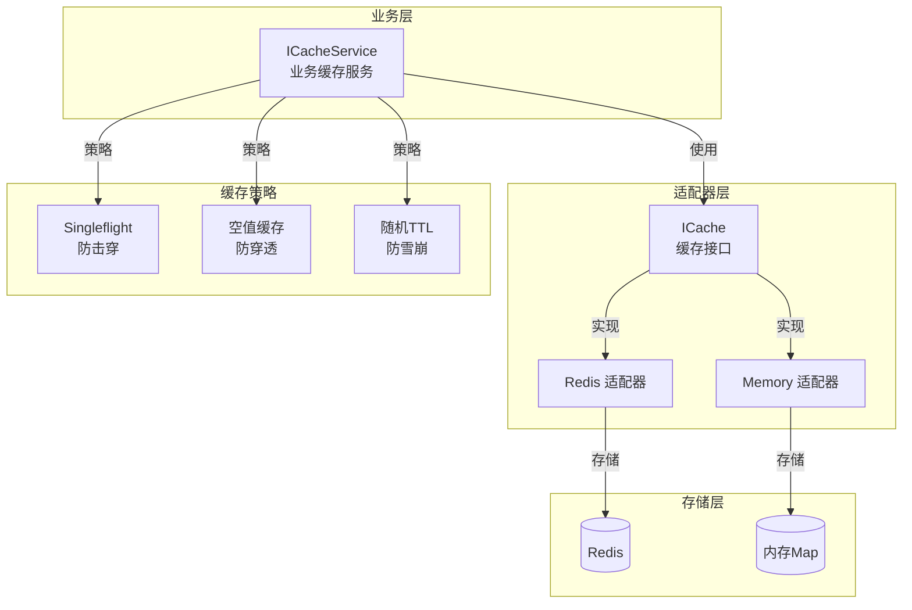
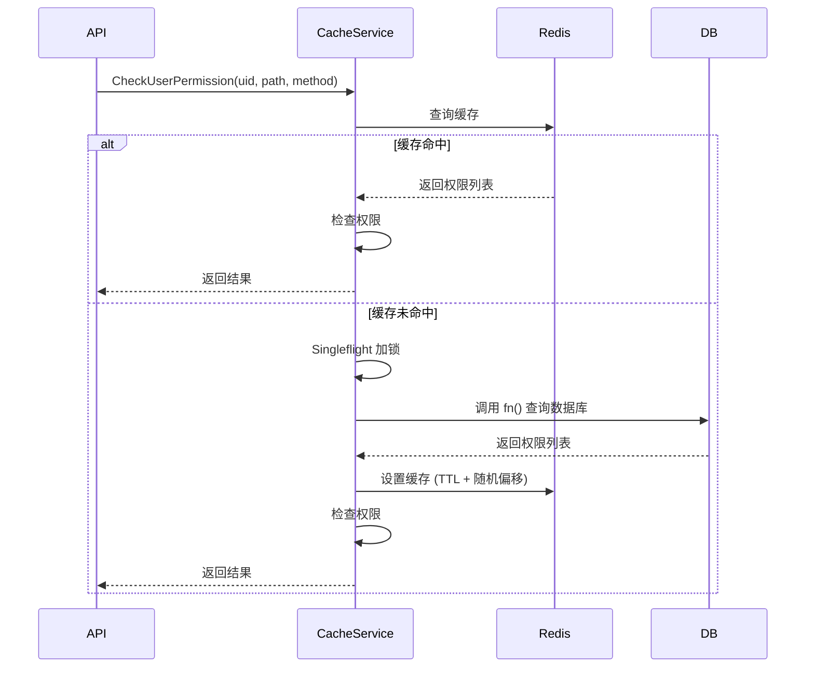
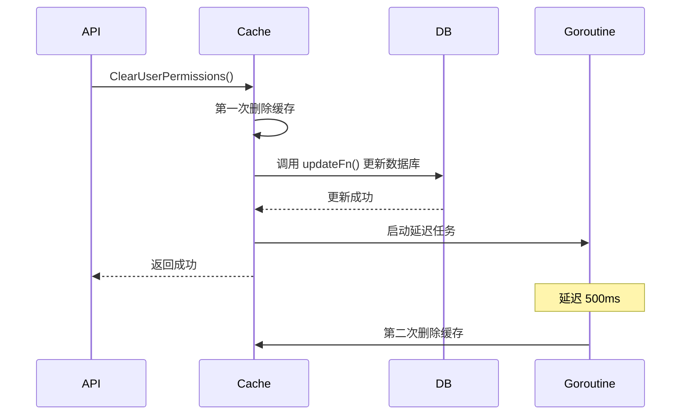

# Cache 缓存系统文档

## 📖 目录

- [概述](#概述)
- [核心特性](#核心特性)
- [架构设计](#架构设计)
- [核心组件](#核心组件)
- [使用指南](#使用指南)
- [配置说明](#配置说明)
- [缓存策略](#缓存策略)
- [最佳实践](#最佳实践)

---

## 概述

Cache 缓存系统提供了统一的缓存抽象层，支持 Redis 和内存两种存储后端。系统实现了完善的缓存安全策略（防穿透、防击穿、防雪崩），并提供了权限缓存、Token 黑名单等业务级缓存服务。

**代码位置：**

- 基础缓存接口：[`pkg/cache/`](file:///Users/zouyuxi/workspace/template/gin-admin/pkg/cache)
- 业务缓存服务：[`internal/services/cache.go`](file:///Users/zouyuxi/workspace/template/gin-admin/internal/services/cache.go)

---

## 核心特性

### ✅ 多后端支持

- **Redis 适配器**：生产环境推荐，支持持久化和分布式部署
- **内存适配器**：开发/测试环境，无需外部依赖

### ✅ 统一接口

- 基于接口设计，可无缝切换存储后端
- 支持基础操作（Get/Set/Delete）
- 支持集合操作（SAdd/SRem/SIsMember）
- 支持计数器（Incr/Decr）
- 支持批量操作（Pipeline）

### ✅ 缓存安全策略

- **防穿透**：空值缓存，避免查询不存在的数据
- **防击穿**：singleflight 机制，同一 Key 只有一个请求查询数据库
- **防雪崩**：TTL 随机偏移，避免缓存同时过期

### ✅ 业务缓存服务

- 权限缓存（基于 Redis Set）
- Token 黑名单
- 延迟双删策略

---

## 架构设计



### 分层架构

1. **业务层（Service Layer）**

   - 提供高层级缓存服务（权限、Token等）
   - 实现缓存安全策略
   - 统一缓存 Key 管理
2. **适配器层（Adapter Layer）**

   - 统一缓存接口 `ICache`
   - Redis/Memory 适配器实现
   - 屏蔽底层存储差异
3. **存储层（Storage Layer）**

   - Redis 分布式缓存
   - Memory 本地内存缓存

---

## 核心组件

### 1. ICache 接口

[`pkg/cache/interface.go`](file:///Users/zouyuxi/workspace/template/gin-admin/pkg/cache/interface.go#L20-L51)

```go
type ICache interface {
    // ==================== 基础操作 ====================
    Get(ctx context.Context, key string, dest interface{}) error
    Set(ctx context.Context, key string, value interface{}, ttl time.Duration) error
    Delete(ctx context.Context, keys ...string) error
    Exists(ctx context.Context, key string) (bool, error)
  
    // ==================== 集合操作 ====================
    SAdd(ctx context.Context, key string, members ...interface{}) error
    SRem(ctx context.Context, key string, members ...interface{}) error
    SIsMember(ctx context.Context, key string, member interface{}) (bool, error)
    SMembers(ctx context.Context, key string) ([]interface{}, error)
  
    // ==================== 计数器 ====================
    Incr(ctx context.Context, key string) (int64, error)
    Decr(ctx context.Context, key string) (int64, error)
  
    // ==================== TTL 管理 ====================
    Expire(ctx context.Context, key string, ttl time.Duration) error
    TTL(ctx context.Context, key string) (time.Duration, error)
  
    // ==================== 批量操作 ====================
    Pipeline() Pipeline
  
    // ==================== 连接管理 ====================
    Ping(ctx context.Context) error
    Close() error
  
    // ==================== 前缀删除 ====================
    DeletePrefix(ctx context.Context, prefix string) error
}
```

### 2. ICacheService 接口

[`internal/services/cache.go`](file:///Users/zouyuxi/workspace/template/gin-admin/internal/services/cache.go#L22-L39)

```go
type ICacheService interface {
    // ==================== 权限缓存 ====================
    // 检查用户权限（带缓存 + 防穿透 + 防击穿）
    CheckUserPermission(ctx context.Context, userID uint, path, method string, 
        fn func(ctx context.Context, uid uint) ([]rbac.Resource, error)) (bool, error)
  
    // 设置用户权限缓存
    SetUserPermissions(ctx context.Context, userID uint, resources []rbac.Resource) error
  
    // 清除指定用户权限缓存（延迟双删）
    ClearUserPermissions(ctx context.Context, userID uint, ttl time.Duration, 
        updateFn func() error) error
  
    // 批量清除多个用户权限缓存
    ClearMultipleUsersPermissions(ctx context.Context, userIDs []uint, ttl time.Duration, 
        updateFn func() error) error
  
    // 清除所有权限缓存
    ClearAllPermissions(ctx context.Context) error
  
    // ==================== Token 黑名单 ====================
    BlacklistToken(ctx context.Context, token string, ttl time.Duration) error
    IsTokenBlacklisted(ctx context.Context, token string) (bool, error)
  
    // ==================== 通用缓存操作 ====================
    GetInstance(ctx context.Context, key string, dest interface{}) error
    SetInstance(ctx context.Context, key string, value interface{}, ttl time.Duration) error
    DeleteInstance(ctx context.Context, keys ...string) error
    Exists(ctx context.Context, key string) (bool, error)
}
```

### 3. Redis 适配器

[`pkg/cache/redis_adapter.go`](file:///Users/zouyuxi/workspace/template/gin-admin/pkg/cache/redis_adapter.go)

**特点：**

- 基于 `go-redis/redis` 实现
- 支持 Pipeline 批量操作
- 数据自动 JSON 序列化/反序列化
- 使用 Lua 脚本批量删除前缀 Key

### 4. Memory 适配器

[`pkg/cache/memory_adapter.go`](file:///Users/zouyuxi/workspace/template/gin-admin/pkg/cache/memory_adapter.go)

**特点：**

- 基于 Go Map + sync.RWMutex 实现
- 支持 TTL 自动过期（定时清理）
- 适用于开发/测试环境
- 单机部署，重启数据丢失

---

## 使用指南

### 1️⃣ 初始化缓存

#### 方式 1：使用 Redis（推荐生产环境）

```go
import (
    "gin-admin/pkg/cache"
    "github.com/go-redis/redis/v8"
)

// 创建 Redis 客户端
redisClient := redis.NewClient(&redis.Options{
    Addr:     "localhost:6379",
    Password: "your-password",
    DB:       0,
})

// 创建 Redis 缓存适配器
cacheInstance, err := cache.NewRedisCache(redisClient)
if err != nil {
    panic(err)
}

// 测试连接
err = cacheInstance.Ping(context.Background())
if err != nil {
    log.Fatal("Redis 连接失败:", err)
}
```

#### 方式 2：使用内存缓存（开发/测试）

```go
import "gin-admin/pkg/cache"

// 创建内存缓存
cacheInstance := cache.NewMemoryCache()
```

#### 方式 3：使用工厂模式（推荐）

[`pkg/cache/factory.go`](file:///Users/zouyuxi/workspace/template/gin-admin/pkg/cache/factory.go)

```go
import (
    "gin-admin/pkg/cache"
    "github.com/go-redis/redis/v8"
)

func InitCache(config *Config) cache.ICache {
    if config.Redis.Enabled {
        // 使用 Redis
        client := redis.NewClient(&redis.Options{
            Addr:     config.Redis.Addr,
            Password: config.Redis.Password,
            DB:       config.Redis.DB,
        })
        cacheInstance, _ := cache.NewRedisCache(client)
        return cacheInstance
    }
  
    // 使用内存缓存
    return cache.NewMemoryCache()
}
```

### 2️⃣ 基础操作

#### Get/Set/Delete

```go
ctx := context.Background()

// 设置缓存（10分钟过期）
err := cacheInstance.Set(ctx, "user:1", map[string]interface{}{
    "id":   1,
    "name": "Alice",
}, 10*time.Minute)

// 获取缓存
var user map[string]interface{}
err = cacheInstance.Get(ctx, "user:1", &user)
if err == cache.ErrKeyNotFound {
    // 缓存不存在
}

// 删除缓存
err = cacheInstance.Delete(ctx, "user:1")

// 批量删除
err = cacheInstance.Delete(ctx, "user:1", "user:2", "user:3")
```

#### 检查是否存在

```go
exists, err := cacheInstance.Exists(ctx, "user:1")
if exists {
    fmt.Println("缓存存在")
}
```

### 3️⃣ 集合操作（Redis Set）

权限缓存使用 Redis Set 存储，可以高效检查权限。

```go
ctx := context.Background()
key := "permission:user:1"

// 添加权限
err := cacheInstance.SAdd(ctx, key, "GET_/api/v1/users", "POST_/api/v1/posts")

// 检查是否有权限
hasPerm, err := cacheInstance.SIsMember(ctx, key, "GET_/api/v1/users")
if hasPerm {
    fmt.Println("用户有该权限")
}

// 获取所有权限
members, err := cacheInstance.SMembers(ctx, key)

// 删除权限
err = cacheInstance.SRem(ctx, key, "POST_/api/v1/posts")
```

### 4️⃣ 计数器操作

```go
ctx := context.Background()

// 递增计数
count, err := cacheInstance.Incr(ctx, "visitor:count")
fmt.Println("访问次数:", count)

// 递减计数
count, err = cacheInstance.Decr(ctx, "stock:product:1")
```

### 5️⃣ Pipeline 批量操作

Pipeline 可以减少网络往返次数，提升性能。

```go
ctx := context.Background()
pipe := cacheInstance.Pipeline()

// 批量添加
pipe.Set(ctx, "key1", "value1", time.Hour)
pipe.Set(ctx, "key2", "value2", time.Hour)
pipe.SAdd(ctx, "set1", "member1", "member2")

// 执行
err := pipe.Exec(ctx)
```

### 6️⃣ 业务缓存服务

#### 权限缓存

[`internal/services/cache.go`](file:///Users/zouyuxi/workspace/template/gin-admin/internal/services/cache.go#L79-L131) 中的 `CheckUserPermission()`

```go
import "gin-admin/internal/services"

// 创建缓存服务
cacheService := services.NewCacheService(cacheInstance)

// 检查用户权限（自动处理缓存）
hasPermission, err := cacheService.CheckUserPermission(
    ctx,
    userID,
    "/api/v1/users",
    "GET",
    func(ctx context.Context, uid uint) ([]rbac.Resource, error) {
        // 从数据库加载用户权限
        return userRepo.GetUserPermissions(ctx, uid)
    },
)

if hasPermission {
    // 允许访问
}
```

**工作流程：**



#### 清除权限缓存（延迟双删）

```go
// 清除单个用户权限缓存
err := cacheService.ClearUserPermissions(
    ctx,
    userID,
    500*time.Millisecond,  // 延迟时间
    func() error {
        // 更新数据库
        return userRepo.UpdatePermissions(ctx, userID, newPermissions)
    },
)

// 批量清除多个用户权限缓存
err = cacheService.ClearMultipleUsersPermissions(
    ctx,
    []uint{1, 2, 3},
    500*time.Millisecond,
    func() error {
        // 批量更新数据库
        return roleRepo.UpdateRolePermissions(ctx, roleID, newPermissions)
    },
)
```

**延迟双删流程：**



#### Token 黑名单

```go
// 加入黑名单（Token 剩余有效期）
err := cacheService.BlacklistToken(ctx, token, 10*time.Minute)

// 检查是否在黑名单
isBlacklisted, err := cacheService.IsTokenBlacklisted(ctx, token)
if isBlacklisted {
    // Token 已被撤销
}
```

### 7️⃣ 前缀删除

批量删除指定前缀的所有 Key（使用 Lua 脚本，原子操作）。

```go
// 删除所有权限缓存
err := cacheInstance.DeletePrefix(ctx, "permission:")

// 删除所有用户缓存
err = cacheInstance.DeletePrefix(ctx, "user:")
```

---

## 配置说明

配置文件：[`config/app.yaml.template`](file:///Users/zouyuxi/workspace/template/gin-admin/config/app.yaml.template#L60-L67)

```yaml
cache:
  host: localhost         # Redis 主机地址
  port: 6379             # Redis 端口
  password: "123456"     # Redis 密码（可选）
  db: 0                  # Redis 数据库编号（0-15）
  pool_size: 10          # 连接池大小
```

> ⚠️ **注意**
>
> - 如果不配置 `cache` 节点，系统会自动使用内存缓存
> - 生产环境强烈推荐使用 Redis
> - 多实例部署必须使用 Redis

---

## 缓存策略

### 🛡️ 1. 防穿透（Cache Penetration）

**问题：** 查询不存在的数据，缓存和数据库都没有，每次请求都打到数据库。

**解决方案：** 空值缓存

```go
// 查询不到数据时，缓存空标记
if len(resources) == 0 {
    emptyMarker := "_EMPTY_"
    cacheInstance.SAdd(ctx, cacheKey, emptyMarker)
    cacheInstance.Expire(ctx, cacheKey, 5*time.Minute)
}
```

**代码位置：** [`internal/services/cache.go`](file:///Users/zouyuxi/workspace/template/gin-admin/internal/services/cache.go#L143-L152) 中的 `SetUserPermissions()`

### ⚡ 2. 防击穿（Cache Breakdown）

**问题：** 热点 Key 过期瞬间，大量请求同时查询数据库。

**解决方案：** Singleflight 机制

```go
import "golang.org/x/sync/singleflight"

var sg singleflight.Group

// 同一时刻，同一个 Key 只有一个请求去查询数据库
sfKey := fmt.Sprintf("load_permission:%d", userID)
_, err, _ := sg.Do(sfKey, func() (interface{}, error) {
    // 查询数据库
    resources, err := fn(ctx, userID)
    if err != nil {
        return nil, err
    }
    // 设置缓存
    return nil, s.SetUserPermissions(ctx, userID, resources)
})
```

**代码位置：** [`internal/services/cache.go`](file:///Users/zouyuxi/workspace/template/gin-admin/internal/services/cache.go#L106-L124) 中的 `CheckUserPermission()`

### 🌨️ 3. 防雪崩（Cache Avalanche）

**问题：** 大量缓存同时过期，数据库压力激增。

**解决方案：** TTL 随机偏移

```go
// 基础 TTL + 随机偏移（0-2分钟）
func getPermissionTTL() time.Duration {
    offset := time.Duration(rand.Int63n(int64(2 * time.Minute)))
    return 10*time.Minute + offset
}
```

**代码位置：** [`internal/services/cache.go`](file:///Users/zouyuxi/workspace/template/gin-admin/internal/services/cache.go#L165-L170)

### 🔄 4. 延迟双删（Delayed Double Delete）

**问题：** 数据库更新后，缓存可能存在短暂不一致。

**解决方案：** 删除缓存 → 更新数据库 → 延迟再删除缓存

```go
// 第一次删除
cache.Delete(ctx, key)

// 更新数据库
updateFn()

// 异步延迟删除（500ms）
go func() {
    time.Sleep(500 * time.Millisecond)
    cache.Delete(context.Background(), key)
}()
```

**为什么需要第二次删除？**

假设以下时序：

1. 请求 A：删除缓存
2. 请求 B：查询缓存（未命中）
3. 请求 B：查询数据库（旧数据）
4. 请求 A：更新数据库
5. 请求 B：设置缓存（旧数据）

这样缓存就是脏数据。延迟第二次删除可以清除这种脏数据。

**代码位置：** [`internal/services/cache.go`](file:///Users/zouyuxi/workspace/template/gin-admin/internal/services/cache.go#L188-L200) 中的 `ClearUserPermissions()`

---

## 最佳实践

### ✅ 推荐做法

1. **合理设置 TTL**

   - 热点数据：1-10 分钟
   - 普通数据：10-30 分钟
   - 冷数据：1-24 小时
2. **使用业务前缀**

   ```go
   const (
       CacheKeyUser       = "user:%d"        // user:123
       CacheKeyPermission = "permission:%d"  // permission:123
       CacheKeyToken      = "token:%s"       // token:abc
   )
   ```
3. **序列化复杂对象**

   ```go
   // ✅ 推荐：自动 JSON 序列化
   cache.Set(ctx, "user:1", userStruct, ttl)

   var user User
   cache.Get(ctx, "user:1", &user)
   ```
4. **使用 Pipeline 批量操作**

   ```go
   pipe := cache.Pipeline()
   for _, user := range users {
       pipe.Set(ctx, fmt.Sprintf("user:%d", user.ID), user, ttl)
   }
   pipe.Exec(ctx)
   ```
5. **错误处理**

   ```go
   err := cache.Get(ctx, key, &data)
   if err == cache.ErrKeyNotFound {
       // 缓存不存在，查询数据库
       data, _ = db.Query(...)
       cache.Set(ctx, key, data, ttl)
   } else if err != nil {
       // 缓存服务异常，降级到数据库
       log.Error("缓存异常:", err)
       data, _ = db.Query(...)
   }
   ```

### ❌ 避免的做法

1. ❌ **不要缓存过大的对象**

   - 单个 Key 超过 1MB 会影响性能
   - 可以拆分为多个 Key 或使用压缩
2. ❌ **不要设置过长的 TTL**

   - 容易导致数据不一致
   - 建议不超过 24 小时
3. ❌ **不要忽略缓存错误**

   ```go
   // ❌ 错误做法
   cache.Set(ctx, key, value, ttl)  // 忽略错误

   // ✅ 正确做法
   if err := cache.Set(ctx, key, value, ttl); err != nil {
       log.Error("缓存写入失败:", err)
   }
   ```
4. ❌ **不要在循环中单个查询缓存**

   ```go
   // ❌ 错误做法
   for _, id := range ids {
       cache.Get(ctx, fmt.Sprintf("user:%d", id), &user)
   }

   // ✅ 正确做法：使用 Pipeline
   pipe := cache.Pipeline()
   for _, id := range ids {
       pipe.Get(ctx, fmt.Sprintf("user:%d", id))
   }
   pipe.Exec(ctx)
   ```

---

## 常见问题

### Q1: Redis 和内存缓存有什么区别？


| 特性     | Redis             | Memory              |
| -------- | ----------------- | ------------------- |
| 持久化   | ✅ 支持           | ❌ 重启丢失         |
| 分布式   | ✅ 支持多实例共享 | ❌ 单机隔离         |
| 容量     | 💾 数十GB         | 🧠 受限于内存       |
| 性能     | 🚀 极快（网络IO） | ⚡ 最快（本地访问） |
| 适用场景 | 生产环境          | 开发/测试           |

### Q2: 如何监控缓存命中率？

在 `CacheService` 中添加统计：

```go
type cacheStats struct {
    hits   atomic.Int64
    misses atomic.Int64
}

func (s *cacheService) CheckUserPermission(...) {
    exists, _ := s.client.Exists(ctx, cacheKey)
    if exists {
        s.stats.hits.Add(1)  // 命中
    } else {
        s.stats.misses.Add(1)  // 未命中
    }
}

func (s *cacheService) GetHitRate() float64 {
    hits := s.stats.hits.Load()
    total := hits + s.stats.misses.Load()
    return float64(hits) / float64(total)
}
```

### Q3: 缓存穿透、击穿、雪崩有什么区别？


| 问题     | 场景             | 解决方案               |
| -------- | ---------------- | ---------------------- |
| **穿透** | 查询不存在的数据 | 空值缓存、布隆过滤器   |
| **击穿** | 热点Key过期瞬间  | Singleflight、永不过期 |
| **雪崩** | 大量Key同时过期  | TTL随机偏移、集群部署  |

### Q4: 延迟双删的延迟时间如何确定？

延迟时间需要覆盖：

1. 数据库主从同步延迟（通常 50-200ms）
2. 慢查询时间（通常 100-500ms）

**建议：** 500ms - 1s

如果主从延迟较高，可以适当增加。

---

## 性能优化

### 1. 使用连接池

```go
redisClient := redis.NewClient(&redis.Options{
    PoolSize:     50,               // 连接池大小
    MinIdleConns: 10,               // 最小空闲连接
    MaxConnAge:   time.Hour,        // 连接最大存活时间
    PoolTimeout:  30 * time.Second, // 获取连接超时
})
```

### 2. 批量操作使用 Pipeline

Pipeline 可以减少网络往返次数（RTT）：

- 单次操作：1 RTT
- Pipeline 100 次操作：1 RTT

性能提升可达 **10-100 倍**。

### 3. 使用 Redis Cluster

单机 Redis QPS 约 10 万，集群可达 **百万级**。

---

## 相关文档

- [JWT 认证系统文档](./jwt.md)
- [Repository 数据访问文档](./repository.md)
- [RBAC 自动化权限初始化文档](./rbac-auto-init.md)

---

**最后更新：** 2025-12-03
