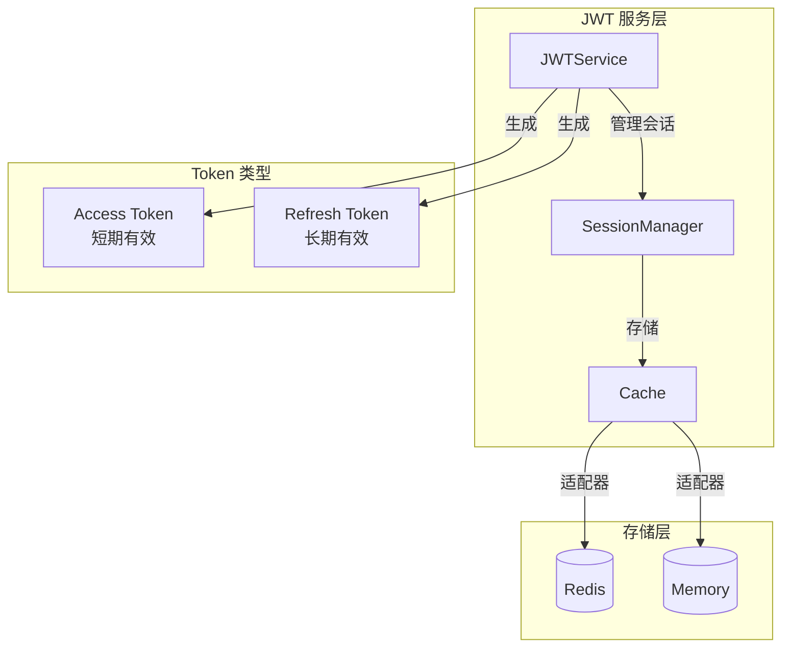
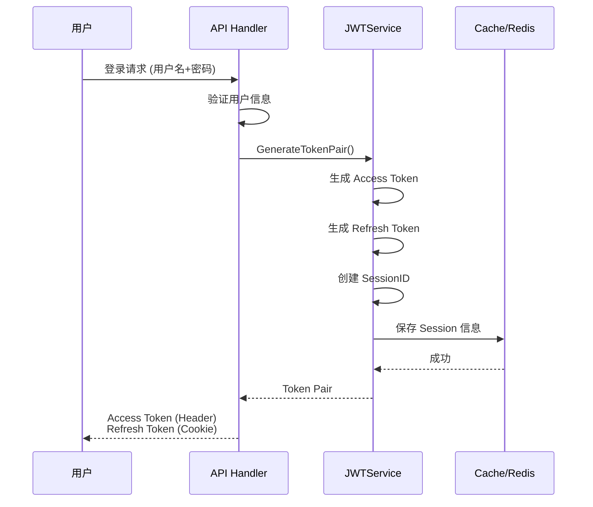
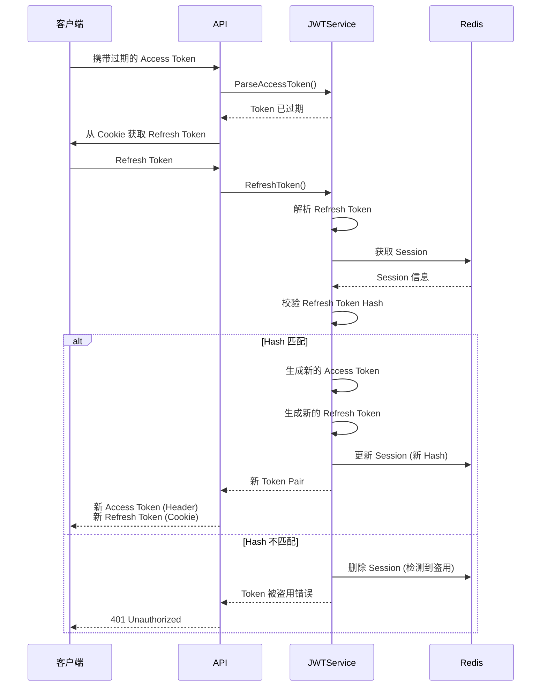

# JWT 认证系统文档

## 📖 目录

- [概述](#概述)
- [核心特性](#核心特性)
- [架构设计](#架构设计)
- [核心组件](#核心组件)
- [使用指南](#使用指南)
- [配置说明](#配置说明)
- [安全机制](#安全机制)
- [最佳实践](#最佳实践)

---

## 概述

JWT (JSON Web Token) 认证系统是本项目的核心安全模块，提供了一套完整的用户认证和会话管理方案。系统基于双 Token 机制（Access Token + Refresh Token），并实现了 Token Rotation、Session 管理等企业级安全特性。

**代码位置：** [`pkg/components/jwt/`](file:///Users/zouyuxi/workspace/template/gin-admin/pkg/components/jwt)

---

## 核心特性

### ✅ 双 Token 机制

- **Access Token**：短期令牌（默认 10 分钟），用于 API 访问
- **Refresh Token**：长期令牌（默认 7 天），用于刷新 Access Token

### ✅ Token Rotation

每次使用 Refresh Token 刷新时，都会生成新的 Refresh Token，旧的立即失效。这可以有效防止 Token 被盗用。

### ✅ Session 管理

- 支持多设备会话管理
- 可撤销单个或全部会话
- Session 状态持久化（Redis）

### ✅ 安全防护

- Refresh Token 重用检测（防盗用）
- Token 哈希校验
- Session 过期自动清理

---

## 架构设计



### 工作流程

#### 1. 用户登录流程



#### 2. Token 刷新流程 (Token Rotation)



---

## 核心组件

### 1. Service 接口

[`pkg/components/jwt/service.go`](file:///Users/zouyuxi/workspace/template/gin-admin/pkg/components/jwt/service.go#L16-L26)

```go
type Service interface {
    // 生成 Token 对（登录时调用）
    GenerateTokenPair(ctx context.Context, userID uint, username, email string, opts ...TokenOption) (*TokenPair, error)
    
    // 解析 Access Token（中间件中调用）
    ParseAccessToken(ctx context.Context, tokenString string) (*CustomClaims, error)
    
    // 刷新 Token（Token 过期时调用）
    RefreshToken(ctx context.Context, refreshToken string) (*TokenPair, error)
    
    // 撤销单个会话（退出登录）
    RevokeSession(ctx context.Context, sessionId string) error
    
    // 撤销用户所有会话（强制退出所有设备）
    RevokeUserAllSessions(ctx context.Context, userID uint) error
}
```

### 2. Token 结构

#### TokenPair - Token 对

[`pkg/components/jwt/types.go`](file:///Users/zouyuxi/workspace/template/gin-admin/pkg/components/jwt/types.go#L28-L35)

```go
type TokenPair struct {
    AccessToken  string    `json:"access_token"`   // 访问令牌
    RefreshToken string    `json:"refresh_token"`  // 刷新令牌
    TokenType    string    `json:"token_type"`     // Bearer
    ExpiresIn    int64     `json:"expires_in"`     // Access Token 过期时间（秒）
    ExpiresAt    time.Time `json:"expires_at"`     // 过期时间点
}
```

#### CustomClaims - JWT 载荷

[`pkg/components/jwt/types.go`](file:///Users/zouyuxi/workspace/template/gin-admin/pkg/components/jwt/types.go#L37-L46)

```go
type CustomClaims struct {
    UserID    uint      `json:"user_id"`     // 用户ID
    Username  string    `json:"username"`    // 用户名
    Email     string    `json:"email"`       // 邮箱
    TokenType TokenType `json:"token_type"`  // access 或 refresh
    DeviceID  string    `json:"device_id"`   // 设备ID（可选）
    SessionID string    `json:"session_id"`  // 会话ID
    jwt.RegisteredClaims                     // 标准字段
}
```

### 3. Session 管理

[`pkg/components/jwt/session.go`](file:///Users/zouyuxi/workspace/template/gin-admin/pkg/components/jwt/session.go#L15-L21)

```go
type SessionManager interface {
    // 保存会话
    SaveSession(ctx context.Context, s *SessionInfo) error
    
    // 获取会话
    GetSession(ctx context.Context, sessionID interface{}) *SessionInfo
    
    // 删除会话
    RemoveSession(ctx context.Context, sessionID string) error
    
    // 更新 Refresh Token Hash
    UpdateRefreshHash(ctx context.Context, sessionID, hash string) error
    
    // 删除用户所有会话
    RemoveUserSessions(ctx context.Context, userID uint) error
}
```

#### SessionInfo - 会话信息

[`pkg/components/jwt/types.go`](file:///Users/zouyuxi/workspace/template/gin-admin/pkg/components/jwt/types.go#L93-L101)

```go
type SessionInfo struct {
    SessionID        string    `json:"session_id"`      // 会话ID
    UserID           uint      `json:"user_id"`         // 用户ID
    Username         string    `json:"username"`        // 用户名
    RefreshTokenHash string    `json:"refresh_hash"`    // Refresh Token 哈希
    ExpiresAt        time.Time `json:"expires_at"`      // 过期时间
    Revoked          bool      `json:"revoked"`         // 是否已撤销
}
```

---

## 使用指南

### 1️⃣ 初始化 JWT 服务

```go
import (
    "gin-admin/pkg/components/jwt"
    "gin-admin/pkg/cache"
)

// 创建缓存实例
cacheInstance := cache.NewRedisCache(redisClient)

// 创建 JWT 配置
jwtConfig := jwt.Config{
    Secret:             "your-secret-key",
    AccessTokenExpire:  10 * time.Minute,
    RefreshTokenExpire: 7 * 24 * time.Hour,
    Issuer:            "your-app",
}

// 创建 JWT 服务
jwtService := jwt.NewJwtService(jwtConfig, cacheInstance)
```

### 2️⃣ 用户登录 - 生成 Token

```go
func Login(c *gin.Context) {
    // 1. 验证用户名和密码
    user, err := validateUser(username, password)
    if err != nil {
        c.JSON(401, gin.H{"error": "用户名或密码错误"})
        return
    }
    
    // 2. 生成 Token 对
    tokenPair, err := jwtService.GenerateTokenPair(
        c.Request.Context(),
        user.ID,
        user.Username,
        user.Email,
    )
    if err != nil {
        c.JSON(500, gin.H{"error": "生成Token失败"})
        return
    }
    
    // 3. 设置 Refresh Token 到 Cookie
    c.SetCookie(
        "X-Refresh-Token",          // name
        tokenPair.RefreshToken,      // value
        7*24*60*60,                  // maxAge (7天)
        "/",                         // path
        "",                          // domain
        false,                       // secure
        true,                        // httpOnly
    )
    
    // 4. 返回 Access Token
    c.JSON(200, gin.H{
        "access_token": tokenPair.AccessToken,
        "token_type":   tokenPair.TokenType,
        "expires_in":   tokenPair.ExpiresIn,
    })
}
```

### 3️⃣ JWT 认证中间件

完整示例：[`internal/middleware/jwt.go`](file:///Users/zouyuxi/workspace/template/gin-admin/internal/middleware/jwt.go)

```go
func JWT(svrCtx *services.ServiceContext) gin.HandlerFunc {
    return func(c *gin.Context) {
        // 1. 从 Header 获取 Access Token
        authHeader := c.GetHeader("Authorization")
        if authHeader == "" {
            c.JSON(401, gin.H{"error": "请先登录"})
            c.Abort()
            return
        }
        
        // 2. 解析 Bearer Token
        parts := strings.SplitN(authHeader, " ", 2)
        if len(parts) != 2 || parts[0] != "Bearer" {
            c.JSON(401, gin.H{"error": "无效的Token格式"})
            c.Abort()
            return
        }
        
        token := parts[1]
        
        // 3. 解析 Access Token
        claims, err := svrCtx.Jwt.ParseAccessToken(c.Request.Context(), token)
        if err == nil {
            // Token 有效，直接放行
            c.Set("uid", claims.UserID)
            c.Set("username", claims.Username)
            c.Set("sessionId", claims.SessionID)
            c.Next()
            return
        }
        
        // 4. Access Token 过期，尝试刷新
        if !errors.Is(err, jwt.ErrTokenExpired) {
            c.JSON(401, gin.H{"error": err.Error()})
            c.Abort()
            return
        }
        
        // 5. 从 Cookie 获取 Refresh Token
        refreshToken, err := c.Cookie("X-Refresh-Token")
        if err != nil {
            c.JSON(401, gin.H{"error": "Token已过期，请重新登录"})
            c.Abort()
            return
        }
        
        // 6. 刷新 Token
        tokenPair, err := svrCtx.Jwt.RefreshToken(c.Request.Context(), refreshToken)
        if err != nil {
            c.JSON(401, gin.H{"error": err.Error()})
            c.Abort()
            return
        }
        
        // 7. 返回新的 Token
        c.Header("X-Set-Access-Token", tokenPair.AccessToken)
        c.SetCookie("X-Refresh-Token", tokenPair.RefreshToken, ...)
        
        // 8. 解析新的 Access Token，设置上下文
        claims, _ = svrCtx.Jwt.ParseAccessToken(c.Request.Context(), tokenPair.AccessToken)
        c.Set("uid", claims.UserID)
        c.Set("username", claims.Username)
        c.Set("sessionId", claims.SessionID)
        c.Next()
    }
}
```

### 4️⃣ 退出登录

```go
func Logout(c *gin.Context) {
    // 获取 SessionID
    sessionID, _ := c.Get("sessionId")
    
    // 撤销会话
    err := jwtService.RevokeSession(c.Request.Context(), sessionID.(string))
    if err != nil {
        c.JSON(500, gin.H{"error": "退出失败"})
        return
    }
    
    // 清除 Cookie
    c.SetCookie("X-Refresh-Token", "", -1, "/", "", false, true)
    
    c.JSON(200, gin.H{"message": "退出成功"})
}
```

### 5️⃣ 强制退出所有设备

```go
func LogoutAllDevices(c *gin.Context) {
    userID, _ := c.Get("uid")
    
    // 撤销用户所有会话
    err := jwtService.RevokeUserAllSessions(c.Request.Context(), userID.(uint))
    if err != nil {
        c.JSON(500, gin.H{"error": "操作失败"})
        return
    }
    
    c.JSON(200, gin.H{"message": "已退出所有设备"})
}
```

---

## 配置说明

配置文件：[`config/app.yaml.template`](file:///Users/zouyuxi/workspace/template/gin-admin/config/app.yaml.template#L50-L58)

```yaml
jwt:
  # JWT 密钥（生产环境必须修改！）
  secret: "your-secret-key-should-be-at-least-32-characters"
  
  # Access Token 过期时间
  access_token_expire: 600s  # 10分钟
  
  # Refresh Token 过期时间
  refresh_token_expire: 168h  # 7天
  
  # Token 签发者
  issuer: "gin-admin"
```

### 配置说明

| 配置项 | 类型 | 说明 | 默认值 |
|--------|------|------|--------|
| `secret` | string | JWT 签名密钥，**生产环境必须修改** | - |
| `access_token_expire` | duration | Access Token 过期时间，建议 5-15 分钟 | 10m |
| `refresh_token_expire` | duration | Refresh Token 过期时间，建议 7-30 天 | 7d |
| `issuer` | string | Token 签发者标识 | gin-admin |

> ⚠️ **安全提示**
> - `secret` 必须是强随机字符串，长度至少 32 字符
> - 生产环境建议使用环境变量或密钥管理服务存储 `secret`
> - 不要将 `secret` 提交到版本控制系统

---

## 安全机制

### 🔐 Token Rotation（令牌轮换）

**问题：** Refresh Token 有效期长（通常 7-30 天），如果被盗用，攻击者可以长期访问系统。

**解决方案：** 每次使用 Refresh Token 刷新时，生成新的 Refresh Token，旧的立即失效。

**实现逻辑：**

1. 用户使用 Refresh Token 请求刷新
2. 系统验证 Refresh Token 的哈希值
3. 如果有效，生成新的 Access Token 和 Refresh Token
4. 更新 Session 中的 Refresh Token 哈希
5. 返回新的 Token Pair

**代码位置：** [`pkg/components/jwt/service.go`](file:///Users/zouyuxi/workspace/template/gin-admin/pkg/components/jwt/service.go#L166-L226) 中的 `RefreshToken()` 方法

### 🛡️ Refresh Token 重用检测

**问题：** 如果 Refresh Token 被盗，攻击者和合法用户可能同时使用该 Token。

**检测机制：**

1. 每个 Session 只存储最新的 Refresh Token 哈希
2. 刷新时，比对提交的 Token 哈希和存储的哈希
3. 如果不匹配，说明 Token 被重用（可能被盗）
4. 立即删除该 Session，强制用户重新登录

**代码示例：**

```go
// 校验 refresh token hash
if !SecureCompare(Hash(refreshToken), session.RefreshTokenHash) {
    // 检测到盗用，删除 Session
    s.sessionManager.RemoveSession(ctx, claims.SessionID)
    return nil, ErrRefreshTokenStolen
}
```

### 🔑 Hash 校验

Refresh Token 不以明文存储，而是存储其哈希值，防止缓存泄露导致 Token 泄露。

**哈希算法：** [`pkg/components/jwt/hash.go`](file:///Users/zouyuxi/workspace/template/gin-admin/pkg/components/jwt/hash.go)

```go
func Hash(token string) string {
    h := sha256.New()
    h.Write([]byte(token))
    return hex.EncodeToString(h.Sum(nil))
}

func SecureCompare(a, b string) bool {
    return subtle.ConstantTimeCompare([]byte(a), []byte(b)) == 1
}
```

### 🚪 Session 管理

- **多设备支持：** 每个设备登录创建独立 Session
- **会话撤销：** 支持撤销单个或所有设备的会话
- **自动过期：** Session 随 Refresh Token 过期自动清理

---

## 最佳实践

### ✅ 推荐做法

1. **Access Token 放在请求头**
   ```
   Authorization: Bearer <access_token>
   ```

2. **Refresh Token 放在 HttpOnly Cookie**
   ```go
   c.SetCookie("X-Refresh-Token", token, maxAge, "/", "", secure, true)
   ```
   - 防止 XSS 攻击窃取 Refresh Token
   - `httpOnly=true` 防止 JavaScript 访问

3. **使用 HTTPS**
   - 防止中间人攻击窃取 Token

4. **合理设置过期时间**
   - Access Token: 5-15 分钟
   - Refresh Token: 7-30 天

5. **敏感操作要求重新登录**
   - 修改密码、删除账户等操作
   - 调用 `RevokeUserAllSessions()` 强制重新登录

### ❌ 避免的做法

1. ❌ **不要在 URL 中传递 Token**
   - URL 会被记录在日志中
   - 容易通过 Referer 泄露

2. ❌ **不要在 LocalStorage 存储 Refresh Token**
   - 容易受到 XSS 攻击

3. ❌ **不要忽略 Token 过期时间**
   - 及时刷新 Token，避免频繁要求用户登录

4. ❌ **不要在前端暴露 Secret**
   - Secret 应该只存在于服务端

---

## 错误处理

```go
var (
    ErrInvalidToken         = errors.New("invalid token")              // Token 无效
    ErrExpiredToken         = errors.New("expired token")              // Token 已过期
    ErrSessionInvalid       = errors.New("session invalid or revoked") // Session 无效或已撤销
    ErrRefreshTokenStolen   = errors.New("refresh token stolen")       // Token 被盗用
    ErrRefreshNotAllowed    = errors.New("refresh not allowed")        // 不允许刷新
    ErrUnsupportedTokenType = errors.New("unsupported token type")     // 不支持的 Token 类型
)
```

---

## 测试

完整测试用例：[`pkg/components/jwt/service_test.go`](file:///Users/zouyuxi/workspace/template/gin-admin/pkg/components/jwt/service_test.go)

### 运行测试

```bash
cd pkg/components/jwt
go test -v
```

### 测试覆盖

- ✅ 生成 Token Pair
- ✅ 解析 Access Token
- ✅ 刷新 Token (Token Rotation)
- ✅ 检测 Refresh Token 重用
- ✅ 撤销 Session
- ✅ 撤销用户所有 Session

---

## 常见问题

### Q1: Access Token 过期后，前端如何处理？

**A:** 有两种方案：

**方案 1：中间件自动刷新（推荐）**

本项目采用此方案。当 Access Token 过期时，中间件自动使用 Refresh Token 刷新，并在响应头中返回新的 Token。

前端需要监听响应头 `X-Set-Access-Token`，如果存在则更新本地存储的 Access Token。

**方案 2：前端主动刷新**

前端收到 401 错误时，调用刷新接口获取新 Token，然后重新发起原请求。

### Q2: 如何实现"记住我"功能？

**A:** 调整 Refresh Token 的过期时间：

- 不勾选"记住我"：Refresh Token 7 天
- 勾选"记住我"：Refresh Token 30 天

```go
var ttl time.Duration
if rememberMe {
    ttl = 30 * 24 * time.Hour
} else {
    ttl = 7 * 24 * time.Hour
}

tokenPair, _ := jwtService.GenerateTokenPair(ctx, userID, username, email,
    jwt.WithRefreshExpire(ttl),  // 自定义过期时间
)
```

### Q3: 如何查看用户当前登录的所有设备？

**A:** 调用 `SessionManager.GetUserSessions()`：

```go
sessions, err := sessionManager.GetUserSessions(ctx, userID)
for _, s := range sessions {
    fmt.Printf("设备: %s, 登录时间: %s\n", s.DeviceID, s.CreatedAt)
}
```

### Q4: Refresh Token 被盗后，合法用户会怎样？

**A:** 当攻击者使用被盗的 Refresh Token 刷新时：

1. 攻击者获得新的 Token Pair
2. Session 中的 Refresh Token Hash 被更新
3. 合法用户再次刷新时，Hash 不匹配
4. 系统检测到盗用，删除 Session
5. 合法用户被强制退出，需要重新登录

这样可以及时发现并阻止攻击。

---

## 相关文档

- [Cache 缓存系统文档](./cache.md)
- [Repository 数据访问文档](./repository.md)
- [RBAC 自动化权限初始化文档](./rbac-auto-init.md)
- [API 文档](http://localhost:8080/swagger/index.html)

---

**最后更新：** 2025-12-03
