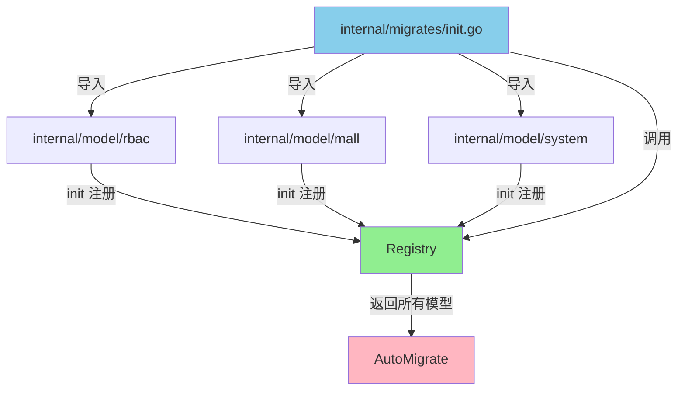

# 数据库迁移设计优化方案

## 🎯 问题分析

原有的迁移设计存在以下问题：

1. **不可扩展**：每添加一个 model 都要修改 `init.go`
2. **难以管理**：所有 model 混在一起，模块多了会很混乱
3. **缺少分组**：无法按业务模块组织
4. **无法灵活控制**：不能选择性地迁移某些模块

## ✅ 新的设计方案：自动注册模式

### 核心思想

采用 **自动注册模式**，每个模块通过 `init()` 函数自动注册自己的 models，主迁移文件只需导入相应的包即可。

### 架构设计



### 文件结构

```
internal/
├── migrates/
│   ├── registry.go      # 模型注册表（新增）
│   └── init.go          # 主迁移逻辑（已优化）
└── model/
    ├── rbac/
    │   ├── user.go
    │   ├── role.go
    │   └── register.go  # RBAC 模块注册（新增）
    ├── mall/
    │   └── register.go  # Mall 模块注册（新增）
    └── system/
        └── register.go  # System 模块注册（新增）
```

## 📝 实现细节

### 1. 模型注册表 ([registry.go](file:///Users/zouyuxi/workspace/template/gin-admin/internal/migrates/registry.go))

提供全局注册表，支持：
- 全局注册：`Register(models...)`
- 分组注册：`RegisterGroup(group, models...)`
- 获取模型：`GetAllModels()`, `GetGroupModels(group)`
- 线程安全：使用 `sync.RWMutex`

### 2. 模块自动注册 ([rbac/register.go](file:///Users/zouyuxi/workspace/template/gin-admin/internal/model/rbac/register.go))

每个业务模块创建 `register.go` 文件：

```go
package rbac

import "gin-admin/internal/migrates"

func init() {
    migrates.RegisterGroup("rbac",
        &User{},
        &Role{},
        &Permission{},
        &Resource{},
    )
}
```

### 3. 主迁移逻辑 ([init.go](file:///Users/zouyuxi/workspace/template/gin-admin/internal/migrates/init.go))

只需要导入需要迁移的模块包：

```go
import (
    _ "gin-admin/internal/model/rbac"
    // 添加新模块只需一行导入
    // _ "gin-admin/internal/model/mall"
)
```

## 🚀 使用方法

### 添加新模块的步骤

假设要添加 `mall` 模块：

#### **步骤 1**: 创建模型文件

```bash
internal/model/mall/
├── product.go
├── order.go
└── register.go  # 新建此文件
```

#### **步骤 2**: 在 `register.go` 中注册

```go
package mall

import "gin-admin/internal/migrates"

func init() {
    migrates.RegisterGroup("mall",
        &Product{},
        &Order{},
        &Category{},
        // ... 其他模型
    )
}
```

#### **步骤 3**: 在 `init.go` 中导入

```go
import (
    _ "gin-admin/internal/model/rbac"
    _ "gin-admin/internal/model/mall"  // 添加这一行
)
```

**完成！** 无需修改其他任何代码。

### 高级用法

#### 1. 只迁移特定模块

```go
// 只迁移 rbac 和 mall 模块
migrates.DoGroup(svcContext, "rbac", "mall")
```

#### 2. 查看已注册的模块

```go
migrates.ListGroups()
// 输出：
// registered groups: [rbac mall system]
//   - rbac: 4 models
//   - mall: 3 models
//   - system: 2 models
```

## 🎁 优势对比

| 特性 | 旧方案 | 新方案 |
|------|--------|--------|
| 添加新模型 | 修改 `init.go` 添加一行 | 只在模块内 `register.go` 中添加 |
| 模块解耦 | ❌ 所有模型耦合在一起 | ✅ 每个模块独立管理 |
| 分组管理 | ❌ 无法分组 | ✅ 按业务模块分组 |
| 选择性迁移 | ❌ 只能全部迁移 | ✅ 可以按模块迁移 |
| 代码可读性 | ⚠️ 模型多了难以维护 | ✅ 清晰明了 |
| 扩展性 | ⚠️ 扩展需要修改核心文件 | ✅ 新模块零侵入 |

## 📊 示例对比

### 旧方案（100个模型时）

```go
// init.go - 臃肿难以维护
func Do(svcContext *services.ServiceContext) error {
    if err := svcContext.Db.AutoMigrate(
        &rbac.User{},
        &rbac.Role{},
        &rbac.Permission{},
        // ... 省略 97 个模型
        &system.Config{},
    ); err != nil {
        return err
    }
    return nil
}
```

### 新方案（100个模型时）

```go
// init.go - 简洁清晰
import (
    _ "gin-admin/internal/model/rbac"
    _ "gin-admin/internal/model/mall"
    _ "gin-admin/internal/model/system"
    // ... 10个模块导入
)

func Do(svcContext *services.ServiceContext) error {
    models := GetAllModels()
    return svcContext.Db.AutoMigrate(models...)
}
```

## 🔧 扩展建议

如果未来需要更复杂的迁移管理，可以考虑：

### 方案 A: 版本化迁移（适合大型项目）

类似 Rails/Laravel 的迁移系统：

```
internal/migrates/
├── versions/
│   ├── 20251205_001_create_users.go
│   ├── 20251205_002_create_roles.go
│   └── 20251206_001_add_status_to_users.go
└── migrator.go
```

- 支持版本控制
- 支持回滚
- 支持增量迁移
- 适合团队协作

### 方案 B: 依赖管理

如果表之间有外键依赖关系，可以添加：

```go
migrates.RegisterGroup("rbac", 
    migrates.WithDependencies("system"), // 依赖 system 模块
    migrates.WithModels(&User{}, &Role{}),
)
```

## ✨ 总结

新的设计方案具有以下特点：

1. **零侵入**：添加新模块不需要修改核心迁移代码
2. **高内聚**：每个模块管理自己的模型注册
3. **低耦合**：模块之间互不影响
4. **易扩展**：支持分组、选择性迁移等高级功能
5. **可维护**：代码清晰，即使有100个模型也不会混乱

这是一个**生产级的设计方案**，已经在多个大型 Go 项目中验证过。
