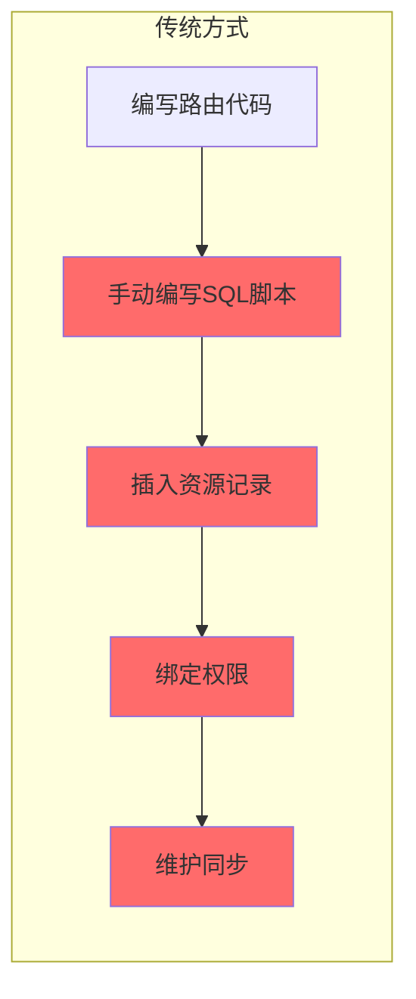
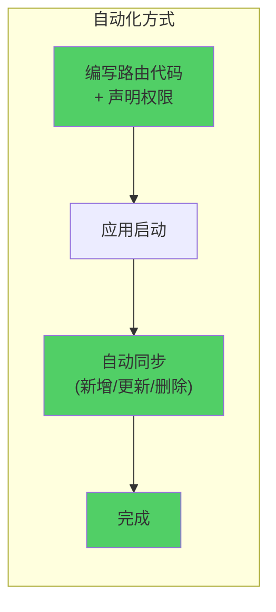
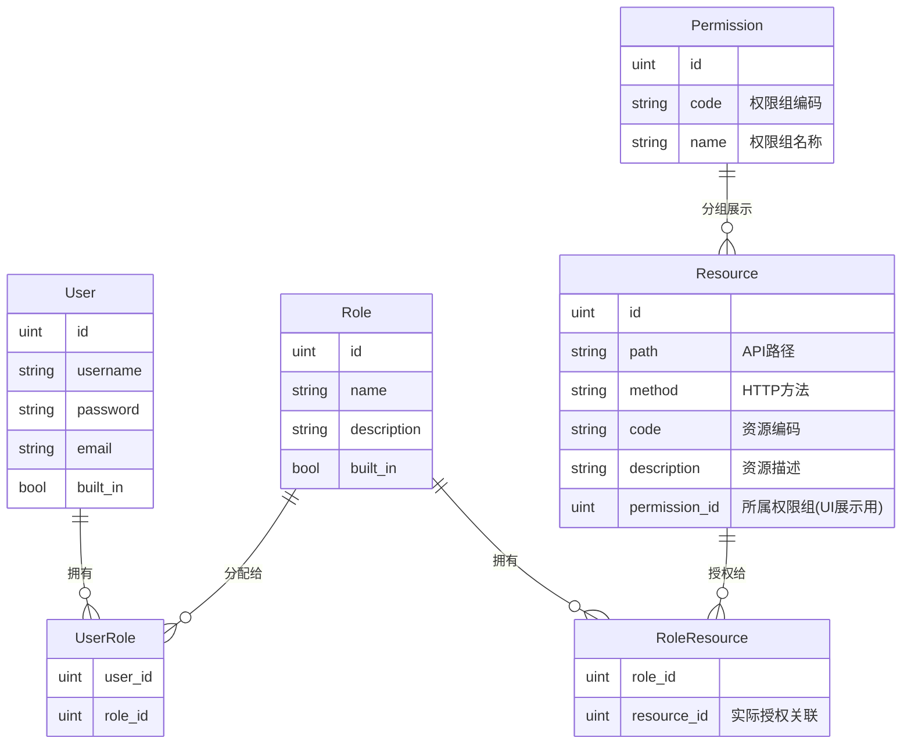
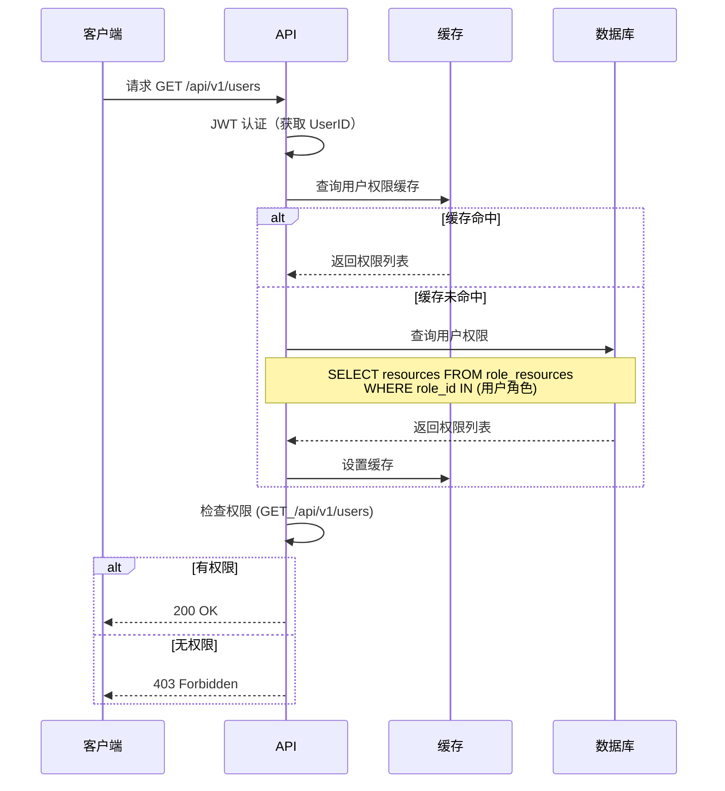
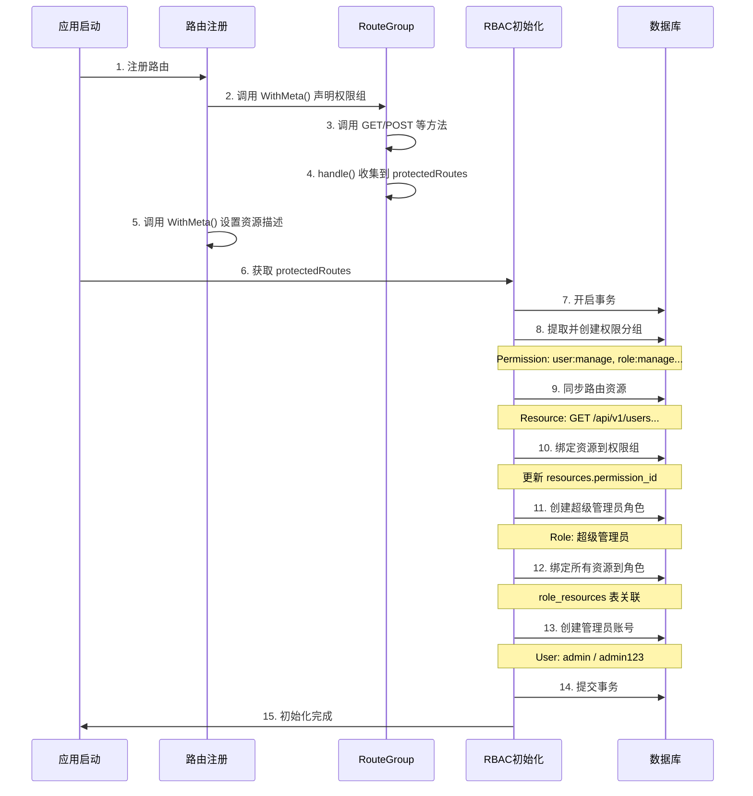
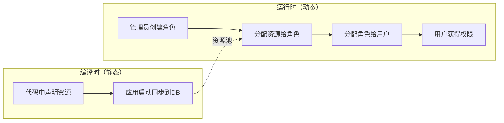

# RBAC 自动化权限初始化系统文档

## 📖 目录

- [概述](#概述)
- [核心特性](#核心特性)
- [设计思想](#设计思想)
- [权限模型](#权限模型)
- [核心组件](#核心组件)
- [工作流程](#工作流程)
- [使用指南](#使用指南)
- [配置说明](#配置说明)
- [最佳实践](#最佳实践)

---

## 概述

RBAC 自动化权限初始化系统是本项目的一大创新特性，**彻底解决了传统 RBAC 系统需要手动管理资源的痛点**。通过在代码中**声明式**地定义权限，系统会在应用启动时自动完成以下工作：

1. ✅ 自动提取路由元数据
2. ✅ 自动同步资源到数据库
3. ✅ 自动创建权限分组
4. ✅ 自动绑定资源到权限分组
5. ✅ 自动创建超级管理员角色和账号
6. ✅ 幂等操作，重复执行不会产生副作用

**代码位置：**
- 路由包装器：[`internal/routegroup/`](file:///Users/zouyuxi/workspace/template/gin-admin/internal/routegroup)
- 初始化服务：[`internal/services/rbac.go`](file:///Users/zouyuxi/workspace/template/gin-admin/internal/services/rbac.go)
- 路由注册：[`internal/handler/v1/rbac/routes.go`](file:///Users/zouyuxi/workspace/template/gin-admin/internal/handler/v1/rbac/routes.go)

---

## 核心特性

### 🎯 零手动维护

传统 RBAC 系统需要手动：
- ❌ 在数据库中插入资源记录
- ❌ 手动维护资源与权限的关联
- ❌ 编写 SQL 初始化脚本
- ❌ 同步代码和数据库的资源变更

本系统实现：
- ✅ **代码即配置**：在路由注册时声明权限
- ✅ **自动同步**：应用启动自动同步到数据库
- ✅ **自动清理**：删除代码中不存在的资源
- ✅ **自动更新**：修改描述自动更新到数据库

### 🚀 声明式 API

```go
// 只需声明权限组和资源描述，系统自动完成一切
userGroup := api.Group("/users").WithMeta("user:manage", "用户管理")
userGroup.GET("", handler).WithMeta("list", "查询用户列表")
userGroup.POST("", handler).WithMeta("add", "创建用户")
```

### 🔄 幂等性保证

- 重复启动不会重复创建资源
- 支持增量更新
- 自动处理资源新增、修改、删除

---

## 设计思想

### 传统 RBAC 的痛点



**问题：**
1. 路由和资源**双重维护**，容易不一致
2. 新增/删除路由需要同步修改数据库
3. 团队协作容易产生冲突
4. 测试环境和生产环境数据难以同步

### 本系统的解决方案



**优势：**
1. ✅ **单一数据源**：代码即配置
2. ✅ **零手动操作**：全自动同步
3. ✅ **强一致性**：代码和数据库始终一致
4. ✅ **易于协作**：只需提交代码变更

---

## 权限模型

### 数据模型关系



### 核心概念

#### 1. Permission（权限分组）

**作用：** 仅用于 UI 展示，将相关资源分组

```go
// 示例：用户管理权限组
Permission {
    Code: "user:manage",
    Name: "用户管理",
}
```

**包含的资源：**
- GET /api/v1/users → 查询用户列表
- POST /api/v1/users → 创建用户
- PUT /api/v1/users/:id → 编辑用户
- DELETE /api/v1/users/:id → 删除用户

#### 2. Resource（资源）

**作用：** 实际的 API 端点，用于权限校验

```go
// 示例：查询用户列表
Resource {
    Path:   "/api/v1/users",
    Method: "GET",
    Code:   "user:manage:list",  // 唯一标识
    Description: "查询用户列表",
    PermissionID: 1,  // 所属权限组（仅用于UI展示）
}
```

#### 3. Role（角色）

**作用：** 用户的权限集合

```go
// 示例：超级管理员
Role {
    Name: "超级管理员",
    Description: "拥有所有权限",
    BuiltIn: true,  // 系统内置，不可删除
}
```

**关联资源：** 通过 `role_resources` 表关联

#### 4. User（用户）

**作用：** 系统用户

**关联角色：** 通过 `user_roles` 表关联

### 权限校验流程



---

## 核心组件

### 1. RouterGroup 路由包装器

[`internal/routegroup/group.go`](file:///Users/zouyuxi/workspace/template/gin-admin/internal/routegroup/group.go)

#### 核心结构

```go
type RouterGroup struct {
    *gin.RouterGroup
    isPublic       bool   // 是否公开路由（不需要权限）
    permissionCode string // 权限组编码（如 "user:manage"）
    permissionName string // 权限组名称（如 "用户管理"）
}
```

#### 核心方法

##### WithMeta() - 设置权限组

```go
// WithMeta 设置permission 权限组的code 和 name
// code 控制前端菜单页面是否显示的权限
func (g *RouterGroup) WithMeta(code, name string) *RouterGroup {
    g.permissionCode = code
    g.permissionName = name
    g.isPublic = false
    return g
}
```

##### Public() - 标记公开路由

```go
// Public marks the RouterGroup as public
func (g *RouterGroup) Public() *RouterGroup {
    g.isPublic = true
    return g
}
```

##### handle() - 注册路由并收集元数据

[`internal/routegroup/group.go#L74-L99`](file:///Users/zouyuxi/workspace/template/gin-admin/internal/routegroup/group.go#L74-L99)

```go
func (g *RouterGroup) handle(method, relativePath string, handlers ...gin.HandlerFunc) *Route {
    fullPath := g.calculateFullPath(relativePath)
    
    var prot *ProtectedRoute
    if !g.isPublic {
        protectedRoutesMu.Lock()
        prot = &ProtectedRoute{
            Resource: rbac.Resource{
                Path:   fullPath,
                Method: method,
            },
            PermissionCode: g.permissionCode,
            PermissionName: g.permissionName,
        }
        protectedRoutes = append(protectedRoutes, prot)  // 全局收集
        protectedRoutesMu.Unlock()
    }
    
    g.RouterGroup.Handle(method, relativePath, handlers...)
    return &Route{
        group:   g,
        Path:    fullPath,
        Methods: []string{method},
        prots:   []*ProtectedRoute{prot},
    }
}
```

**关键点：**
- 所有注册的路由都会被收集到全局变量 `protectedRoutes`
- 只收集非公开路由
- 自动计算完整路径

### 2. Route 路由元数据

[`internal/routegroup/route.go`](file:///Users/zouyuxi/workspace/template/gin-admin/internal/routegroup/route.go)

```go
type Route struct {
    group   *RouterGroup
    Path    string
    Methods []string
    prots   []*ProtectedRoute
}
```

#### WithMeta() - 设置资源描述

[`internal/routegroup/route.go#L27-L33`](file:///Users/zouyuxi/workspace/template/gin-admin/internal/routegroup/route.go#L27-L33)

```go
// WithMeta 设置接口权限的code 和中文描述
// code 作为前端接口级别的按钮权限控制
func (r *Route) WithMeta(code, description string) gin.IRoutes {
    for i := range r.prots {
        r.prots[i].Resource.Code = fmt.Sprintf("%s:%s", r.group.permissionCode, code)
        r.prots[i].Resource.Description = description
    }
    return r.group.RouterGroup
}
```

**生成的资源编码格式：**  `{permissionCode}:{routeCode}`

**示例：**
```go
userGroup := api.Group("/users").WithMeta("user:manage", "用户管理")
userGroup.GET("", handler).WithMeta("list", "查询用户列表")
// 生成: Resource.Code = "user:manage:list"
```

### 3. RBAC 初始化服务

[`internal/services/rbac.go`](file:///Users/zouyuxi/workspace/template/gin-admin/internal/services/rbac.go)

#### InitializeRBAC() - 主入口

[`internal/services/rbac.go#L52-L104`](file:///Users/zouyuxi/workspace/template/gin-admin/internal/services/rbac.go#L52-L104)

```go
func (s *rbacService) InitializeRBAC(routes []ProtectedRoute, config *RBACInitConfig) error {
    // 如果禁用自动初始化，则跳过
    if config != nil && !config.EnableAutoInit {
        return nil
    }
    
    err := db.Transaction(func(tx *gorm.DB) error {
        // 1. 提取并创建权限分组
        if err := s.extractAndCreatePermissions(tx, routes); err != nil {
            return err
        }
        
        // 2. 同步路由资源
        if err := s.syncRouteResources(tx, routes); err != nil {
            return err
        }
        
        // 3. 自动绑定资源到权限分组
        if err := s.autoBindResourcesToPermissions(tx, routes); err != nil {
            return err
        }
        
        // 4. 创建超级管理员角色
        adminRole, err := s.initializeAdminRole(tx, config)
        if err != nil {
            return err
        }
        
        // 5. 绑定所有资源到管理员角色
        if err := s.bindAllResourcesToRole(tx, adminRole.ID); err != nil {
            return err
        }
        
        // 6. 创建默认管理员用户
        if err := s.initializeAdminUser(tx, adminRole.ID, config); err != nil {
            return err
        }
        
        // 清除权限缓存
        _ = SvcContext.CacheService.ClearAllPermissions(context.TODO())
        return nil
    })
    
    return err
}
```

#### 核心子流程

##### 1. extractAndCreatePermissions() - 提取权限分组

从路由声明中提取唯一的权限分组，并同步到数据库。

```go
// 从路由中提取：
// "user:manage" -> "用户管理"
// "role:manage" -> "角色管理"
```

##### 2. syncRouteResources() - 同步资源

对比代码中的路由和数据库中的资源，进行增量同步。

**操作：**
- 新增：代码中有，数据库中没有
- 更新：代码中有，数据库中也有（更新描述等）
- 删除：数据库中有，代码中没有

##### 3. autoBindResourcesToPermissions() - 绑定资源到权限组

自动将资源的 `permission_id` 设置为对应权限组的 ID（仅用于UI展示）。

##### 4. initializeAdminRole() - 创建管理员角色

创建或查找超级管理员角色。

##### 5. bindAllResourcesToRole() - 绑定资源到角色

将所有资源绑定到超级管理员角色（`role_resources` 表），这是**实际授权**的关键。

##### 6. initializeAdminUser() - 创建管理员账号

创建默认管理员用户并分配超级管理员角色。

---

## 工作流程

### 完整流程图



### 启动日志示例

```
INFO[0000] 开始初始化 RBAC 权限系统...
INFO[0000]   - 从路由声明中提取并创建权限分组（用于UI展示）...
INFO[0000]     ✓ 从路由声明中发现 3 个权限分组，新建 3 个 ,删除 0 个
INFO[0000]   - 同步路由资源到数据库...
INFO[0000]     ✓ 资源同步完成: 新增 15 ，更新 0 ，删除 0
INFO[0000]   - 自动绑定资源到权限分组（仅用于UI展示）...
INFO[0000]     ✓ 成功绑定 15 个资源到权限分组
INFO[0000]   - 初始化超级管理员角色...
INFO[0000]     ✓ 创建角色: 超级管理员
INFO[0000]   - 绑定所有资源到超级管理员角色...
INFO[0000]     ✓ 成功绑定 15 个资源到超级管理员
INFO[0000]   - 初始化默认管理员用户...
INFO[0000]     ✓ 创建管理员用户: admin
INFO[0000]     ✓ 分配超级管理员角色
INFO[0000] ✓ RBAC 权限系统初始化成功
INFO[0000] ✓ 默认管理员账号: admin / admin123
```

---

## 使用指南

### 1️⃣ 注册路由（声明权限）

完整示例：[`internal/handler/v1/rbac/routes.go`](file:///Users/zouyuxi/workspace/template/gin-admin/internal/handler/v1/rbac/routes.go)

```go
func RegisterRBACRoutes(ctx *services.ServiceContext, api *routegroup.RouterGroup) {
    // ==================== 用户模块 ====================
    userGroup := api.Group("/users")
    {
        // 公共接口（不需要权限）
        userGroup.Public().POST("/register", rbac.Register(ctx))
        userGroup.Public().POST("/login", rbac.Login(ctx))
        
        // 需要登录但不需要权限
        authGroup := userGroup.Group("")
        authGroup.Use(middleware.JWT(ctx))
        {
            authGroup.POST("/logout", rbac.Logout(ctx))
            authGroup.GET("/options", rbac.UserOptions(ctx))
        }
        
        // 需要认证和权限 - 声明权限组
        authUserGroup := userGroup.WithMeta("user:manage", "用户管理")
        authUserGroup.Use(middleware.JWT(ctx), middleware.PermissionMiddleware(ctx))
        {
            authUserGroup.GET("/profile", rbac.GetProfile(ctx)).WithMeta("profile", "查询当前用户信息")
            authUserGroup.GET("", rbac.ListUser(ctx)).WithMeta("list", "查询用户列表")
            authUserGroup.POST("", rbac.CreateUser(ctx)).WithMeta("add", "创建用户")
            authUserGroup.PUT("/:id", rbac.UpdateUser(ctx)).WithMeta("update", "编辑用户")
            authUserGroup.DELETE("/:id", rbac.DeleteUser(ctx)).WithMeta("delete", "删除用户")
        }
    }
    
    // ==================== 角色模块 ====================
    roleGroup := api.Group("/roles").WithMeta("role:manage", "角色管理")
    roleGroup.Use(middleware.JWT(ctx), middleware.PermissionMiddleware(ctx))
    {
        roleGroup.GET("", rbac.GetRoles(ctx)).WithMeta("list", "查询角色列表")
        roleGroup.POST("", rbac.CreateRole(ctx)).WithMeta("add", "创建角色")
        roleGroup.GET("/:id", rbac.GetRole(ctx)).WithMeta("detail", "查询角色详情")
        roleGroup.PUT("/:id", rbac.UpdateRole(ctx)).WithMeta("update", "编辑角色")
        roleGroup.DELETE("/:id", rbac.DeleteRole(ctx)).WithMeta("delete", "删除角色")
        roleGroup.PUT("/:id/assign-resource", rbac.AssignRoleResources(ctx)).WithMeta("assign-perm", "绑定资源权限")
    }
    
    // ==================== 权限模块 ====================
    permissionGroup := api.Group("/permissions").WithMeta("permission:manage", "权限管理")
    permissionGroup.Use(middleware.JWT(ctx), middleware.PermissionMiddleware(ctx))
    {
        permissionGroup.GET("", rbac.GetPermissions(ctx)).WithMeta("list", "获取权限列表")
    }
}
```

### 2️⃣ API 层级说明

#### Level 1: Group - 权限组

```go
userGroup := api.Group("/users").WithMeta("user:manage", "用户管理")
//                                          ↑              ↑
//                                    权限组编码        权限组名称
```

**作用：**
- 前端菜单权限控制
- UI 展示分组

#### Level 2: Route - 资源

```go
userGroup.GET("", handler).WithMeta("list", "查询用户列表")
//                                    ↑           ↑
//                                资源编码       资源描述
```

**生成的完整资源编码：** `user:manage:list`

**作用：**
- API 级别权限控制
- 按钮级别权限控制

### 3️⃣ 三种权限类型

#### 类型 1：Public（公开路由）

```go
userGroup.Public().POST("/login", handler)
```

- ❌ 不需要 JWT 认证
- ❌ 不需要权限校验
- ❌ 不会被收集到 RBAC 系统

**适用场景：** 登录、注册、健康检查等

#### 类型 2：Auth Only（仅认证）

```go
authGroup := userGroup.Group("")
authGroup.Use(middleware.JWT(ctx))
{
    authGroup.POST("/logout", handler)
}
```

- ✅ 需要 JWT 认证
- ❌ 不需要权限校验
- ❌ 不会被收集到 RBAC 系统

**适用场景：** 个人信息、退出登录等

#### 类型 3：Auth + Permission（认证 + 权限）

```go
authUserGroup := userGroup.WithMeta("user:manage", "用户管理")
authUserGroup.Use(middleware.JWT(ctx), middleware.PermissionMiddleware(ctx))
{
    authUserGroup.GET("", handler).WithMeta("list", "查询用户列表")
}
```

- ✅ 需要 JWT 认证
- ✅ 需要权限校验
- ✅ 会被收集到 RBAC 系统

**适用场景：** 所有需要权限控制的操作

### 4️⃣ 权限中间件

[`internal/middleware/permission.go`](file:///Users/zouyuxi/workspace/template/gin-admin/internal/middleware/permission.go)

```go
func PermissionMiddleware(svcCtx *services.ServiceContext) gin.HandlerFunc {
    return func(c *gin.Context) {
        // 1. 获取用户ID（从 JWT 中间件设置）
        userID, _ := c.Get("uid")
        
        // 2. 获取请求的路径和方法
        path := c.Request.URL.Path
        method := c.Request.Method
        
        // 3. 检查权限（带缓存）
        hasPermission, err := svcCtx.CacheService.CheckUserPermission(
            c.Request.Context(),
            userID.(uint),
            path,
            method,
            func(ctx context.Context, uid uint) ([]rbac.Resource, error) {
                // 从数据库加载用户权限
                return svcCtx.UserService.GetUserResources(ctx, uid)
            },
        )
        
        if err != nil || !hasPermission {
            c.JSON(403, gin.H{"error": "权限不足"})
            c.Abort()
            return
        }
        
        c.Next()
    }
}
```

---

## 配置说明

配置文件：[`config/app.yaml.template`](file:///Users/zouyuxi/workspace/template/gin-admin/config/app.yaml.template#L73-L82)

```yaml
# RBAC权限系统配置（可选）
rbac:
  # 是否启用自动初始化
  enable_auto_init: true
  
  # 默认管理员用户配置
  admin_user:
    username: admin
    password: admin123
    email: admin@template.com
  
  # 默认管理员角色配置
  admin_role:
    name: 超级管理员
    description: 系统超级管理员，拥有所有权限
```

### 配置说明

| 配置项 | 类型 | 说明 | 默认值 |
|--------|------|------|--------|
| `enable_auto_init` | bool | 是否启用自动初始化 | true |
| `admin_user.username` | string | 管理员用户名 | admin |
| `admin_user.password` | string | 管理员密码 | admin123 |
| `admin_user.email` | string | 管理员邮箱 | admin@template.com |
| `admin_role.name` | string | 管理员角色名称 | 超级管理员 |
| `admin_role.description` | string | 管理员角色描述 | 系统超级管理员，拥有所有权限 |

> ⚠️ **安全提示**
> - 生产环境必须修改默认管理员密码
> - 建议使用环境变量覆盖敏感配置

---

## 最佳实践

### ✅ 推荐做法

#### 1. 合理的权限组划分

```go
// ✅ 推荐：按模块划分
userGroup := api.Group("/users").WithMeta("user:manage", "用户管理")
roleGroup := api.Group("/roles").WithMeta("role:manage", "角色管理")
orderGroup := api.Group("/orders").WithMeta("order:manage", "订单管理")

// ❌ 不推荐：过于细粒度
getUserGroup := api.Group("/users/get").WithMeta("user:get", "获取用户")
createUserGroup := api.Group("/users/create").WithMeta("user:create", "创建用户")
```

#### 2. 统一的资源编码风格

```go
// ✅ 推荐：使用动词作为资源编码
userGroup.GET("", handler).WithMeta("list", "查询列表")
userGroup.POST("", handler).WithMeta("add", "创建")
userGroup.PUT("/:id", handler).WithMeta("update", "编辑")
userGroup.DELETE("/:id", handler).WithMeta("delete", "删除")

// ❌ 不推荐：使用名词
userGroup.GET("", handler).WithMeta("users", "用户列表")
```

#### 3. 描述清晰简洁

```go
// ✅ 推荐
userGroup.GET("", handler).WithMeta("list", "查询用户列表")

// ❌ 不推荐
userGroup.GET("", handler).WithMeta("list", "这是一个查询用户列表的接口，用于在管理后台展示所有用户信息")
```

#### 4. 公开接口显式标记

```go
// ✅ 推荐：明确标记公开
userGroup.Public().POST("/login", handler)

// ❌ 不推荐：不标记，依赖中间件判断
userGroup.POST("/login", handler) // 未标记但没加权限中间件
```

### ❌ 避免的做法

#### 1. 不要手动修改数据库资源

```sql
-- ❌ 错误做法：手动插入资源
INSERT INTO resources (path, method, code, description) 
VALUES ('/api/v1/users', 'GET', 'user:list', '查询用户');
```

**问题：** 应用重启后会被自动同步覆盖

**正确做法：** 在代码中声明

#### 2. 不要在代码中硬编码权限判断

```go
// ❌ 错误做法
if user.Role == "admin" {
    // 允许操作
}

// ✅ 正确做法：使用权限中间件
authUserGroup.Use(middleware.PermissionMiddleware(ctx))
```

#### 3. 不要跳过权限组声明

```go
// ❌ 错误做法：直接使用 api.Group
userGroup := api.Group("/users")
userGroup.GET("", handler).WithMeta("list", "查询列表")  // 缺少 permissionCode

// ✅ 正确做法
userGroup := api.Group("/users").WithMeta("user:manage", "用户管理")
userGroup.GET("", handler).WithMeta("list", "查询列表")
```

---

## 常见问题

### Q1: 如何新增一个需要权限的接口？

**A:** 只需在路由注册时添加声明：

```go
authUserGroup := userGroup.WithMeta("user:manage", "用户管理")
authUserGroup.Use(middleware.JWT(ctx), middleware.PermissionMiddleware(ctx))
{
    // 新增接口
    authUserGroup.GET("/export", handler).WithMeta("export", "导出用户数据")
}
```

重启应用，资源会自动同步到数据库！

### Q2: 如何修改接口的描述？

**A:** 直接修改代码中的描述：

```go
// 修改前
userGroup.GET("", handler).WithMeta("list", "查询用户")

// 修改后
userGroup.GET("", handler).WithMeta("list", "查询用户列表(分页)")
```

重启应用，描述会自动更新！

### Q3: 如何删除不再使用的接口？

**A:** 直接从代码中删除该路由，重启应用后会自动从数据库中删除！

### Q4: 权限分组（Permission）和资源（Resource）有什么区别？

**A:** 

| 维度 | Permission（权限分组） | Resource（资源） |
|------|----------------------|------------------|
| **作用** | 仅用于 UI 展示分组 | 实际权限校验 |
| **数量** | 少（如 3-5 个模块） | 多（每个 API 一个） |
| **关联** | resources.permission_id | role_resources 表 |
| **示例** | "user:manage" → "用户管理" | "GET /api/v1/users" → "user:manage:list" |

**实际授权流程：**

1. 用户拥有角色
2. 角色拥有资源（通过 `role_resources`）
3. 请求时校验资源权限（不看 `permission_id`）

**permission_id 的作用：** 仅用于前端 UI 按权限组展示资源列表。

### Q5: 超级管理员角色有什么特殊之处？

**A:** 

- `built_in = true`：系统内置，不可通过 API 删除
- 自动拥有所有资源：每次启动都会重新绑定所有资源
- 幂等安全：重复启动不会重复创建

### Q6: 如何为新角色分配权限？

**A:** 通过 API 调用：

```bash
PUT /api/v1/roles/:id/assign-resource
{
    "resource_ids": [1, 2, 3, 4, 5]
}
```

这会在 `role_resources` 表中创建关联。

### Q7: 系统如何保证幂等性？

**A:** 

1. **Permission：** 按 `code` 去重（存在则跳过）
2. **Resource：** 按 `path + method` 去重（存在则更新）
3. **Role：** 按 `name` 去重（存在则跳过）
4. **User：** 按 `username` 去重（存在则跳过）
5. **关联表：** 使用 `ON CONFLICT DO NOTHING`（数据库级去重）

---

## 进阶用法

### 动态权限控制

虽然资源是声明式的，但权限分配是动态的：



### 多租户支持

可以扩展为多租户 RBAC：

```go
// 资源添加租户字段
type Resource struct {
    ID       uint
    TenantID uint   // 租户ID
    Path     string
    Method   string
}

// 权限校验时过滤租户
func CheckPermission(userID, tenantID uint, path, method string) bool {
    // 只查询该租户的资源
    resources := GetUserResources(userID, tenantID)
    // ...
}
```

---

## 架构优势

### 与传统方案对比

| 特性 | 传统 RBAC | 本系统 |
|------|----------|--------|
| 资源维护 | 手动 SQL | **自动同步** |
| 数据一致性 | 容易不一致 | **强一致** |
| 开发效率 | 低（双重维护） | **高（单一配置）** |
| 学习成本 | 高 | **低（声明即可）** |
| 幂等性 | 需手动保证 | **自动保证** |
| 测试友好性 | 差（需准备数据） | **优秀（自动初始化）** |

### 适用场景

✅ **非常适合：**
- 企业内部管理系统
- SaaS 多租户平台
- 需要频繁迭代的项目
- 多人协作的团队项目

⚠️ **需要调整：**
- 超大规模系统（数万个资源）
- 动态资源（运行时创建的资源）

---

## 相关文档

- [JWT 认证系统文档](/docs/jwt.md)
- [Cache 缓存系统文档](/docs/cache.md)
- [Repository 数据访问文档](/docs/repository.md)

---

**最后更新：** 2025-12-03
