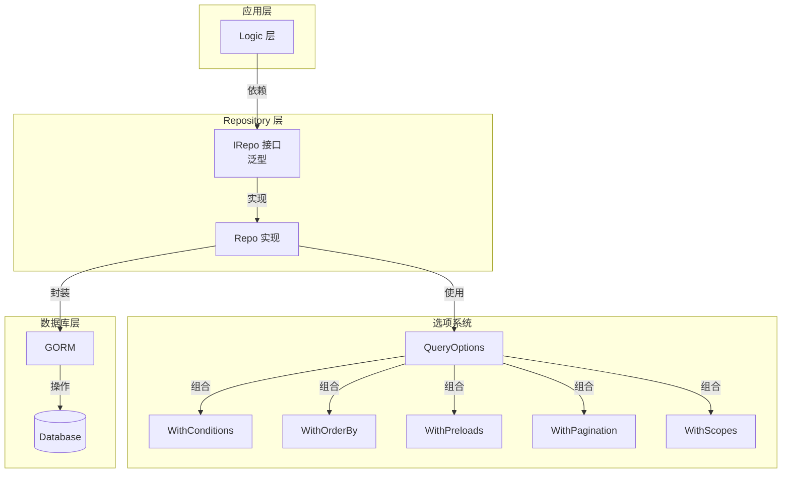

# Repository 数据访问层文档

## 📖 目录

- [概述](#概述)
- [核心特性](#核心特性)
- [架构设计](#架构设计)
- [接口定义](#接口定义)
- [使用指南](#使用指南)
- [查询选项系统](#查询选项系统)
- [高级功能](#高级功能)
- [最佳实践](#最佳实践)

---

## 概述

Repository 数据访问层提供了一套基于泛型的 GORM 封装，通过统一的接口抽象数据库操作。系统设计遵循 Repository 模式，支持完整的 CRUD 操作、复杂查询、分页、事务等企业级功能。

**代码位置：** [`pkg/interface/repo.go`](file:///Users/zouyuxi/workspace/template/gin-admin/pkg/interface/repo.go)

---

## 核心特性

### ✅ 泛型支持

基于 Go 1.18+ 泛型，提供类型安全的数据访问。

```go
// 用户 Repository
userRepo := _interface.NewRepo[model.User](db)

// 角色 Repository
roleRepo := _interface.NewRepo[model.Role](db)
```

### ✅ 统一接口

所有模型使用相同的接口，减少重复代码。

```go
type IRepo[T IModel] interface {
    FindByID(ctx context.Context, id uint, opts ...QueryOption) (*T, error)
    List(ctx context.Context, opts ...QueryOption) ([]T, error)
    Create(ctx context.Context, entity *T) error
    Update(ctx context.Context, entity *T) error
    Delete(ctx context.Context, entity *T) error
    // ... 更多方法
}
```

### ✅ 灵活的查询选项

通过函数式选项模式，灵活组合查询条件。

```go
// 查询示例
users, _ := userRepo.List(ctx,
    WithConditions(map[string]interface{}{"status": 1}),  // 条件
    WithOrderBy("created_at desc"),                       // 排序
    WithPreloads("Roles", "Roles.Permissions"),           // 预加载
    WithSelectFields("id", "username", "email"),          // 指定字段
)
```

### ✅ 分页支持

内置分页查询，自动计算总数和总页数。

```go
result, _ := userRepo.FindPage(ctx,
    WithPagination(1, 10),  // 第1页，每页10条
    WithConditions(map[string]interface{}{"status": 1}),
)
// result.List, result.Total, result.TotalPage
```

### ✅ 事务支持

提供事务封装，自动 commit/rollback。

```go
err := userRepo.Transaction(ctx, func(ctx context.Context, tx *gorm.DB, txRepo IRepo[User]) error {
    // 事务内操作
    txRepo.Create(ctx, &user)
    txRepo.Update(ctx, &profile)
    return nil  // 自动 commit
})
```

---

## 架构设计



### 设计原则

1. **接口抽象**：依赖接口而非实现
2. **泛型复用**：一套实现支持所有模型
3. **函数式选项**：灵活组合查询条件
4. **链式调用**：提升代码可读性

---

## 接口定义

### IRepo 接口

[`pkg/interface/repo.go`](file:///Users/zouyuxi/workspace/template/gin-admin/pkg/interface/repo.go#L104-L182)

```go
type IRepo[T IModel] interface {
    // ==================== 查询操作 ====================
    
    // 通过ID查询
    FindByID(ctx context.Context, id uint, opts ...QueryOption) (*T, error)
    
    // 通过ID列表查询
    FindByIDs(ctx context.Context, ids []uint, opts ...QueryOption) ([]T, error)
    
    // 条件查询单条
    FindOne(ctx context.Context, opts ...QueryOption) (*T, error)
    
    // 条件查询列表
    List(ctx context.Context, opts ...QueryOption) ([]T, error)
    
    // 分页查询
    FindPage(ctx context.Context, opts ...QueryOption) (*PageResult[T], error)
    
    // ==================== 创建操作 ====================
    
    // 创建单条
    Create(ctx context.Context, entity *T) error
    
    // 批量创建
    CreateBatch(ctx context.Context, entities []T, batchSize ...int) error
    
    // ==================== 更新操作 ====================
    
    // 更新记录（非零值字段）
    Update(ctx context.Context, entity *T) error
    
    // 根据ID更新指定字段
    UpdateByID(ctx context.Context, id uint, updates map[string]interface{}) error
    
    // 根据条件批量更新
    UpdateByCondition(ctx context.Context, condition map[string]interface{}, updates map[string]interface{}) error
    
    // ==================== 删除操作 ====================
    
    // 删除记录
    Delete(ctx context.Context, entity *T) error
    
    // 根据ID删除
    DeleteByID(ctx context.Context, id uint) error
    
    // 根据ID列表批量删除
    DeleteByIDs(ctx context.Context, ids []uint) error
    
    // 根据条件删除
    DeleteByCondition(ctx context.Context, condition map[string]interface{}) error
    
    // ==================== 统计操作 ====================
    
    // 统计记录数
    Count(ctx context.Context, condition map[string]interface{}) (int64, error)
    
    // 检查是否存在
    Exists(ctx context.Context, opts ...QueryOption) (bool, error)
    
    // 检查ID是否存在
    ExistsByID(ctx context.Context, id uint) (bool, error)
    
    // ==================== 高级操作 ====================
    
    // 查找或创建
    FirstOrCreate(ctx context.Context, condition map[string]interface{}, entity *T) error
    
    // ==================== 事务支持 ====================
    
    // 执行事务
    Transaction(ctx context.Context, fn func(ctx context.Context, tx *gorm.DB, txRepo IRepo[T]) error) error
}
```

### IModel 接口约束

所有模型必须实现 `IModel` 接口（通常继承 `gorm.Model`）：

```go
type IModel interface {
    GetID() uint
}
```

示例模型：

```go
type User struct {
    gorm.Model
    Username string
    Email    string
}

func (u *User) GetID() uint {
    return u.ID
}
```

---

## 使用指南

### 1️⃣ 创建 Repository

```go
import (
    "gin-admin/pkg/interface"
    "gin-admin/internal/model"
    "gorm.io/gorm"
)

func NewUserRepo(db *gorm.DB) _interface.IRepo[model.User] {
    return _interface.NewRepo[model.User](db)
}
```

### 2️⃣ 基础 CRUD

#### 创建

```go
// 创建单条
user := &model.User{
    Username: "alice",
    Email:    "alice@example.com",
}
err := userRepo.Create(ctx, user)

// 批量创建（默认批次大小100）
users := []model.User{
    {Username: "alice"},
    {Username: "bob"},
}
err = userRepo.CreateBatch(ctx, users)

// 自定义批次大小
err = userRepo.CreateBatch(ctx, users, 50)
```

#### 查询

```go
// 通过 ID 查询
user, err := userRepo.FindByID(ctx, 1)

// 通过 ID 列表查询
users, err := userRepo.FindByIDs(ctx, []uint{1, 2, 3})

// 条件查询单条
user, err = userRepo.FindOne(ctx,
    WithConditions(map[string]interface{}{"username": "alice"}),
)

// 条件查询列表
users, err = userRepo.List(ctx,
    WithConditions(map[string]interface{}{"status": 1}),
    WithOrderBy("created_at desc"),
)

// 查询全部
users, err = userRepo.List(ctx)
```

#### 更新

```go
// 更新整个对象（非零值字段）
user.Email = "newemail@example.com"
err := userRepo.Update(ctx, user)

// 根据 ID 更新指定字段
err = userRepo.UpdateByID(ctx, 1, map[string]interface{}{
    "status":     1,
    "updated_at": time.Now(),
})

// 根据条件批量更新
err = userRepo.UpdateByCondition(ctx,
    map[string]interface{}{"status": 0},  // 条件：status = 0
    map[string]interface{}{"status": 1},  // 更新：status = 1
)
```

#### 删除

```go
// 删除对象
err := userRepo.Delete(ctx, user)

// 根据 ID 删除
err = userRepo.DeleteByID(ctx, 1)

// 批量删除
err = userRepo.DeleteByIDs(ctx, []uint{1, 2, 3})

// 根据条件删除
err = userRepo.DeleteByCondition(ctx, map[string]interface{}{
    "status": 0,
})
```

### 3️⃣ 分页查询

```go
result, err := userRepo.FindPage(ctx,
    WithPagination(1, 10),  // 第1页，每页10条
    WithConditions(map[string]interface{}{"status": 1}),
    WithOrderBy("created_at desc"),
)

if err != nil {
    return err
}

fmt.Println("总数:", result.Total)
fmt.Println("总页数:", result.TotalPage)
fmt.Println("当前页:", result.Page)
fmt.Println("数据:", result.List)
```

**PageResult 结构：**

```go
type PageResult[T any] struct {
    List      []T   `json:"list"`       // 数据列表
    Total     int64 `json:"total"`      // 总记录数
    Page      int   `json:"page"`       // 当前页码
    PageSize  int   `json:"pageSize"`   // 每页大小
    TotalPage int   `json:"totalPage"`  // 总页数
}
```

### 4️⃣ 统计操作

```go
// 统计总数
count, err := userRepo.Count(ctx, map[string]interface{}{"status": 1})

// 检查是否存在
exists, err := userRepo.Exists(ctx,
    WithConditions(map[string]interface{}{"username": "alice"}),
)

// 检查 ID 是否存在
exists, err = userRepo.ExistsByID(ctx, 1)
```

### 5️⃣ 查找或创建

```go
user := &model.User{
    Username: "alice",
    Email:    "alice@example.com",
}

// 如果 username = "alice" 不存在，则创建
err := userRepo.FirstOrCreate(ctx,
    map[string]interface{}{"username": "alice"},
    user,
)
```

---

## 查询选项系统

### QueryOptions 结构

[`pkg/interface/repo.go`](file:///Users/zouyuxi/workspace/template/gin-admin/pkg/interface/repo.go#L17-L26)

```go
type QueryOptions struct {
    SelectFields []string                      // 查询字段
    Preloads     []string                      // 预加载关联
    OrderBy      string                        // 排序
    Conditions   map[string]interface{}        // 筛选条件
    Page         int                           // 分页页码
    PageSize     int                           // 分页大小
    Scopes       []func(db *gorm.DB) *gorm.DB  // 自定义作用域
}
```

### 选项函数

#### WithSelectFields - 指定查询字段

```go
users, _ := userRepo.List(ctx,
    WithSelectFields("id", "username", "email"),
)
// SELECT id, username, email FROM users
```

#### WithPreloads - 预加载关联

```go
users, _ := userRepo.List(ctx,
    WithPreloads("Roles"),  // 预加载角色
)

// 多级预加载
users, _ = userRepo.List(ctx,
    WithPreloads("Roles", "Roles.Permissions"),
)
```

#### WithOrderBy - 排序

```go
users, _ := userRepo.List(ctx,
    WithOrderBy("created_at desc"),
)

// 多字段排序
users, _ = userRepo.List(ctx,
    WithOrderBy("status asc, created_at desc"),
)
```

#### WithConditions - 条件查询

```go
users, _ := userRepo.List(ctx,
    WithConditions(map[string]interface{}{
        "status": 1,
        "role":   "admin",
    }),
)
// WHERE status = 1 AND role = 'admin'
```

#### WithPagination - 分页

```go
result, _ := userRepo.FindPage(ctx,
    WithPagination(2, 20),  // 第2页，每页20条
)
```

#### WithScopes - 自定义作用域

用于复杂查询条件，如模糊匹配、范围查询等。

```go
users, _ := userRepo.List(ctx,
    WithScopes(
        LikeScope("username", "alice"),  // username LIKE 'alice%'
        RangeScope("age", 18, 60),       // age >= 18 AND age <= 60
    ),
)
```

### 内置 Scope 函数

#### LikeScope - 模糊匹配

[`pkg/interface/repo.go`](file:///Users/zouyuxi/workspace/template/gin-admin/pkg/interface/repo.go#L71-L80)

```go
// 前缀匹配（使用索引）
users, _ := userRepo.List(ctx,
    WithScopes(LikeScope("username", "alice")),
)
// WHERE username LIKE 'alice%'
```

> ⚠️ **注意**：使用前缀匹配（`keyword%`）而非完全模糊匹配（`%keyword%`），因为后者无法使用索引。

#### RangeScope - 范围查询

[`pkg/interface/repo.go`](file:///Users/zouyuxi/workspace/template/gin-admin/pkg/interface/repo.go#L82-L92)

```go
users, _ := userRepo.List(ctx,
    WithScopes(RangeScope("age", 18, 60)),
)
// WHERE age >= 18 AND age <= 60

// 只设置开始
users, _ = userRepo.List(ctx,
    WithScopes(RangeScope("created_at", startTime, nil)),
)
// WHERE created_at >= startTime
```

### 组合使用

```go
users, err := userRepo.List(ctx,
    WithConditions(map[string]interface{}{"status": 1}),
    WithScopes(
        LikeScope("username", "alice"),
        RangeScope("age", 18, 60),
    ),
    WithOrderBy("created_at desc"),
    WithPreloads("Roles"),
    WithSelectFields("id", "username", "email"),
)
```

生成的 SQL：

```sql
SELECT id, username, email 
FROM users 
WHERE status = 1 
  AND username LIKE 'alice%' 
  AND age >= 18 AND age <= 60 
ORDER BY created_at desc
```

---

## 高级功能

### 🔄 事务

[`pkg/interface/repo.go`](file:///Users/zouyuxi/workspace/template/gin-admin/pkg/interface/repo.go#L410-L415)

```go
err := userRepo.Transaction(ctx, func(ctx context.Context, tx *gorm.DB, txRepo IRepo[User]) error {
    // 在事务中创建用户
    user := &model.User{Username: "alice"}
    if err := txRepo.Create(ctx, user); err != nil {
        return err  // 自动 rollback
    }
    
    // 在事务中创建关联数据
    profile := &model.Profile{UserID: user.ID}
    if err := profileRepo.Create(ctx, profile); err != nil {
        return err  // 自动 rollback
    }
    
    return nil  // 自动 commit
})
```

**事务特性：**

- 自动 commit/rollback
- 支持嵌套事务
- txRepo 是事务专用的 Repository

### 🔍 自定义 Scope

创建可复用的查询条件：

```go
// 软删除范围
func NotDeletedScope() func(db *gorm.DB) *gorm.DB {
    return func(db *gorm.DB) *gorm.DB {
        return db.Where("deleted_at IS NULL")
    }
}

// 激活用户范围
func ActiveUserScope() func(db *gorm.DB) *gorm.DB {
    return func(db *gorm.DB) *gorm.DB {
        return db.Where("status = ?", 1).Where("email_verified = ?", true)
    }
}

// 使用
users, _ := userRepo.List(ctx,
    WithScopes(NotDeletedScope(), ActiveUserScope()),
)
```

### 📊 复杂查询示例

#### 示例 1：带关联的分页查询

```go
result, err := userRepo.FindPage(ctx,
    WithPagination(1, 10),
    WithConditions(map[string]interface{}{"status": 1}),
    WithPreloads("Roles", "Roles.Permissions"),
    WithOrderBy("created_at desc"),
)
```

#### 示例 2：模糊搜索 + 时间范围

```go
users, err := userRepo.List(ctx,
    WithScopes(
        LikeScope("username", keyword),
        RangeScope("created_at", startTime, endTime),
    ),
    WithOrderBy("created_at desc"),
)
```

#### 示例 3：OR 条件查询

```go
// 自定义 OR Scope
func OrConditionScope(conditions ...map[string]interface{}) func(db *gorm.DB) *gorm.DB {
    return func(db *gorm.DB) *gorm.DB {
        for i, cond := range conditions {
            if i == 0 {
                db = db.Where(cond)
            } else {
                db = db.Or(cond)
            }
        }
        return db
    }
}

// 使用
users, _ := userRepo.List(ctx,
    WithScopes(OrConditionScope(
        map[string]interface{}{"username": "alice"},
        map[string]interface{}{"email": "alice@example.com"},
    )),
)
// WHERE username = 'alice' OR email = 'alice@example.com'
```

---

## 最佳实践

### ✅ 推荐做法

1. **依赖接口而非实现**

```go
// ✅ 推荐
type UserService struct {
    userRepo _interface.IRepo[model.User]
}

// ❌ 不推荐
type UserService struct {
    userRepo *_interface.Repo[model.User]
}
```

2. **使用查询选项而非原生 GORM**

```go
// ✅ 推荐
users, _ := userRepo.List(ctx,
    WithConditions(map[string]interface{}{"status": 1}),
)

// ❌ 不推荐
db.Where("status = ?", 1).Find(&users)
```

3. **避免 N+1 查询，使用预加载**

```go
// ✅ 推荐：1 + 1 = 2 次查询
users, _ := userRepo.List(ctx,
    WithPreloads("Roles"),
)

// ❌ 不推荐：1 + N 次查询
users, _ := userRepo.List(ctx)
for _, user := range users {
    db.Model(&user).Association("Roles").Find(&user.Roles)
}
```

4. **批量操作使用 batch 方法**

```go
// ✅ 推荐：批量插入
userRepo.CreateBatch(ctx, users, 100)

// ❌ 不推荐：循环插入
for _, user := range users {
    userRepo.Create(ctx, user)
}
```

5. **更新操作注意零值问题**

```go
// Update() 只更新非零值字段
user.Status = 0  // 不会更新！
userRepo.Update(ctx, user)

// ✅ 使用 UpdateByID 更新零值
userRepo.UpdateByID(ctx, user.ID, map[string]interface{}{
    "status": 0,  // 可以更新为 0
})
```

6. **删除/更新前检查条件是否为空**

Repository 内部已检查，防止误删除：

```go
// 如果 condition 为空，会返回错误
err := userRepo.DeleteByCondition(ctx, map[string]interface{}{})
// Error: delete condition cannot be empty to prevent accidental deletion
```

### ❌ 避免的做法

1. ❌ **不要在循环中查询数据库**

```go
// ❌ 错误做法
for _, id := range userIDs {
    user, _ := userRepo.FindByID(ctx, id)
}

// ✅ 正确做法
users, _ := userRepo.FindByIDs(ctx, userIDs)
```

2. ❌ **不要忽略错误**

```go
// ❌ 错误做法
user, _ := userRepo.FindByID(ctx, id)

// ✅ 正确做法
user, err := userRepo.FindByID(ctx, id)
if err != nil {
    if errors.Is(err, gorm.ErrRecordNotFound) {
        return ErrUserNotFound
    }
    return err
}
```

3. ❌ **不要在事务外修改对象**

```go
// ❌ 错误做法
userRepo.Transaction(ctx, func(ctx, tx, txRepo) error {
    user, _ := txRepo.FindByID(ctx, 1)
    user.Status = 1
    userRepo.Update(ctx, user)  // 使用原 repo，不在事务中
    return nil
})

// ✅ 正确做法
userRepo.Transaction(ctx, func(ctx, tx, txRepo) error {
    user, _ := txRepo.FindByID(ctx, 1)
    user.Status = 1
    txRepo.Update(ctx, user)  // 使用 txRepo
    return nil
})
```

---

## 常见问题

### Q1: 如何处理软删除？

GORM 原生支持软删除，只需在模型中包含 `gorm.DeletedAt`：

```go
type User struct {
    ID        uint
    Username  string
    DeletedAt gorm.DeletedAt `gorm:"index"`
}
```

Repository 的 `Delete` 方法会自动软删除：

```go
userRepo.DeleteByID(ctx, 1)  // 软删除，设置 deleted_at
```

如需硬删除：

```go
db.Unscoped().Delete(&user)  // 硬删除
```

### Q2: 如何实现唯一性检查？

使用 `Exists` 方法：

```go
exists, _ := userRepo.Exists(ctx,
    WithConditions(map[string]interface{}{"username": "alice"}),
)
if exists {
    return errors.New("用户名已存在")
}
```

或使用数据库唯一索引：

```go
type User struct {
    ID       uint
    Username string `gorm:"uniqueIndex"`
}
```

### Q3: 分页查询性能如何优化？

1. **添加索引**

```go
type User struct {
    ID        uint
    Status    int       `gorm:"index"`
    CreatedAt time.Time `gorm:"index"`
}
```

2. **避免 COUNT(*)**

对于大数据量，COUNT 很慢。可以使用估算：

```go
// 第一次查询精确 total
result, _ := userRepo.FindPage(ctx, WithPagination(1, 10))

// 后续页使用缓存的 total
// ...
```

3. **使用游标分页**

对于超大数据量，使用游标代替偏移：

```go
users, _ := userRepo.List(ctx,
    WithScopes(func(db *gorm.DB) *gorm.DB {
        return db.Where("id > ?", lastID).Limit(10)
    }),
)
```

### Q4: 如何扩展 Repository？

如果需要特定模型的专属方法：

```go
type IUserRepo interface {
    _interface.IRepo[model.User]
    
    // 自定义方法
    FindByUsername(ctx context.Context, username string) (*model.User, error)
}

type UserRepo struct {
    *_interface.Repo[model.User]
}

func (r *UserRepo) FindByUsername(ctx context.Context, username string) (*model.User, error) {
    return r.FindOne(ctx, WithConditions(map[string]interface{}{"username": username}))
}

// 创建
func NewUserRepo(db *gorm.DB) IUserRepo {
    return &UserRepo{
        Repo: _interface.NewRepo[model.User](db).(*_interface.Repo[model.User]),
    }
}
```

---

## 性能优化

### 1. 索引优化

```go
type User struct {
    ID        uint
    Username  string    `gorm:"index"`                    // 单列索引
    Email     string    `gorm:"uniqueIndex"`              // 唯一索引
    Status    int       `gorm:"index:idx_status_created"` // 复合索引
    CreatedAt time.Time `gorm:"index:idx_status_created"` // 复合索引
}
```

### 2. 查询优化

- 只查询需要的字段：`WithSelectFields("id", "username")`
- 避免 N+1 查询：`WithPreloads("Roles")`
- 使用批量操作：`CreateBatch`, `DeleteByIDs`

### 3. 连接池配置

```go
sqlDB, _ := db.DB()
sqlDB.SetMaxOpenConns(100)        // 最大打开连接数
sqlDB.SetMaxIdleConns(10)         // 最大空闲连接数
sqlDB.SetConnMaxLifetime(time.Hour) // 连接最大存活时间
```

---

## 相关文档

- [JWT 认证系统文档](./jwt.md)
- [Cache 缓存系统文档](./cache.md)
- [RBAC 全自动同步文档](./rbac-auto-init.md)
- [GORM 官方文档](https://gorm.io/zh_CN/docs/)

---

**最后更新：** 2025-12-03
